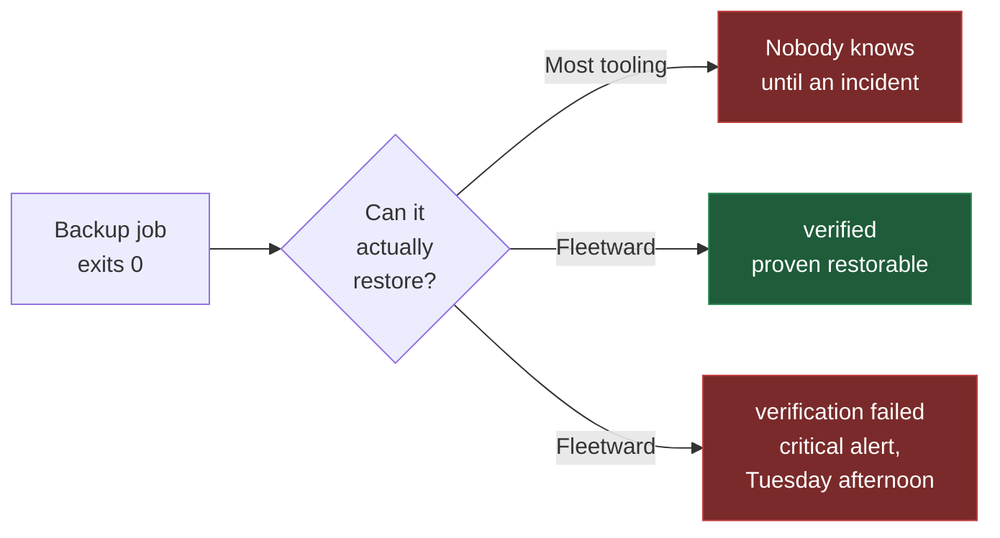

<div align="center">

# Fleetward

**A multi-engine DBA operations control plane — with backups that prove themselves.**

[](https://github.com/danmorcov88/Fleetward/actions/workflows/ci.yml)
[](LICENSE)
[](https://go.dev)
[](api/proto/fleetward/v1/plugin.proto)
[](docs/dev/STATUS.md)

[Why](docs/why.md) · [Architecture](docs/architecture.md) · [Engines](docs/engines.md) · [Quickstart](#quickstart) · [Roadmap](docs/roadmap.md) · [Contributing](.github/CONTRIBUTING.md)

</div>

---

## Why Fleetward

Most backup tooling reports success when a *backup job* exits zero. That is not the same thing as
having a **restorable** backup, and the gap between those two facts is where data loss lives.

Fleetward closes it. Every backup can be automatically restored into a throwaway container of the
matching engine and version, then smoke-tested against a manifest captured at backup time. The
result is a first-class state, not a footnote.



A backup that succeeded but failed verification is surfaced as **critical** — louder than having no
backup at all, because it is more dangerous. It is the difference between knowing you are exposed
and believing you are safe.

Fleetward exists for the DBA responsible for fifty servers who cannot physically verify all of them
in a working week. It reads the backups your existing cron and scripts already take, so it reports
on the whole estate from day one without you migrating anything — and the backups it takes itself
carry a manifest that makes full verification possible. The two are never shown as the same green
checkmark.

**More:** [why Fleetward exists](docs/why.md) · [how it is built](docs/architecture.md) ·
[which engines](docs/engines.md)

---

## Quickstart

Requires **Docker** and **Docker Compose** to run the stack. The CLI steps further down build from
source, which needs **Go 1.25+** — or use the `fleetward-cli` already inside the control-plane
container, via `docker compose exec fleetward fleetward-cli …`.

```bash
git clone https://github.com/danmorcov88/Fleetward.git
cd Fleetward
make dev
```

That brings up the full stack — control plane, PostgreSQL, VictoriaMetrics, MinIO, Dex, and the web
UI.

| Service | URL | Credentials |
|---|---|---|
| Web UI | <http://localhost:3000> | — |
| Control plane API | <http://localhost:8080> | — |
| MinIO console | <http://localhost:9001> | `fleetward` / `fleetward-dev-secret` |
| Dex (OIDC) | <http://localhost:5556/dex> | `admin@fleetward.local` / `admin` |

Check it is live:

```bash
curl -s localhost:8080/readyz | jq
```

```json
{
  "status": "healthy",
  "components": [
    { "name": "metadb",   "status": "healthy", "critical": true,  "latency_ms": 8 },
    { "name": "objstore", "status": "healthy", "critical": false, "latency_ms": 14 },
    { "name": "plugins",  "status": "healthy", "critical": false, "latency_ms": 8 },
    { "name": "secrets",  "status": "healthy", "critical": true,  "latency_ms": 21 },
    { "name": "tsdb",     "status": "healthy", "critical": false, "latency_ms": 10 }
  ]
}
```

`/healthz` is liveness and touches nothing external — a restart cannot fix an unreachable database,
and restart loops during a brief outage make everything worse. `/readyz` is readiness and does check
dependencies. Only the metadata store and secrets provider are critical; the rest degrade readiness
rather than failing it, so a MinIO outage does not take the estate view offline.

> **Port already in use?** Every published port is overridable. Copy [`.env.example`](.env.example)
> to `.env` and change what collides — developer machines routinely already run a Postgres or a
> MinIO.

> [!WARNING]
> The compose stack is **development configuration**. Every credential in it is published in this
> repository, TLS is disabled on every listener, and authentication is off by default. Never expose
> it to a network you do not fully control. See [SECURITY.md](.github/SECURITY.md).

### Add your first server

```bash
make build-cli

bin/fleetward-cli environment add production --production

FLEETWARD_DB_PASSWORD=… bin/fleetward-cli instance add prod-1 \
  --environment production \
  --engine postgresql \
  --host db.example.internal --port 5432 \
  --username fleetward --database app

bin/fleetward-cli instance health prod-1
```

```
prod-1  UP
  endpoint   db.example.internal:5432
  version    16.2
  latency    3.1ms
  signal     connection_usage       INFO 4%
```

`instance discover prod-1` then fills in the topology, the version, and the databases with their
sizes and owners; `instance list` shows the estate.

There is deliberately **no `--password` flag**. The password comes from `FLEETWARD_DB_PASSWORD` or
from `--password-stdin`, because a password in a command line is visible to every process on the host
through `ps` and is kept in the shell history of whoever typed it.

The CLI is a REST client and nothing more — it never opens a connection to the metadata store. A CLI
holding that password would put it on every operator's laptop and would duplicate authorization in a
second place.

The same operations over HTTP, since the API is the only interface either client uses:

```bash
curl -sS -X POST localhost:8080/api/v1/environments \
  -H 'content-type: application/json' \
  -d '{"name":"production","is_production":true}' | jq

curl -sS localhost:8080/api/v1/instances | jq
```

Credentials go in and never come back out. The password is encrypted by the `SecretsProvider`
([ADR-0009](docs/adr/0009-secrets-provider-interface.md)) and stored apart from everything else about
the connection; `ConnectionSpec` is inbound-only, and no read path has a field that could return it.

### Take a backup

```bash
bin/fleetward-cli backup run --instance prod-1
```

```
backup 99946af5-d519-44f6-8372-6a7279b9f52b started on prod-1
  running
  succeeded
id             99946af5-d519-44f6-8372-6a7279b9f52b
state          SUCCEEDED
method         pg_dump
artifact       fleetward-backups/tenants/…/backups/99946af5-…/artifact
size           66.9 KiB
checksum       SHA256 de833d41846a7489d917493d3d6b228a0807e088573bb5a1d92eae7c8d68306f
duration       0.406s
consistent to  2026-08-29T13:54:11Z
manifest       19 objects, 12 records
```

The `manifest` line is the point. It records what the source actually contained at the moment the
artifact was taken — counted inside the same exported snapshot the dump reads, so the two can never
describe different moments. `backup show <id> --manifest` lists every object and its record count.
Without it, "verification" would mean nothing more than "the restore command exited zero".

`backup run` starts the backup and follows it; the run itself happens in the control plane, so
`--wait=false` returns immediately and `backup show` picks it up later.

### Prove it can be restored

```bash
bin/fleetward-cli backup verify --backup 99946af5-d519-44f6-8372-6a7279b9f52b
```

```
verification 4b1e0c72-8f3a-4d5e-b6c7-1a2b3c4d5e6f started for backup 99946af5-…
id        4b1e0c72-8f3a-4d5e-b6c7-1a2b3c4d5e6f
backup    99946af5-d519-44f6-8372-6a7279b9f52b
status    VERIFIED
duration  24.8s

CHECK            RESULT  DETAIL
connectivity     pass    the restored instance accepts connections and reports version 16.2
schema_presence  pass    all 19 objects the manifest recorded are present
record_counts    pass    12 rows across 19 objects match the manifest exactly
```

Fleetward pulls a container of the engine version **that produced the artifact** — not the version
the instance runs today, because an instance can be upgraded between a backup and its verification —
restores into it, counts what arrived with the very same code that counted the source, and destroys
the container on every path out, including a panic.

Three outcomes are possible, and they are deliberately different answers:

| Status | Meaning |
|---|---|
| `VERIFIED` | The restored copy matches the manifest, object for object and row for row |
| `FAILED` | It does not. This backup is not what it claims to be — the loudest thing Fleetward reports |
| `INCONCLUSIVE` | The question could not be answered: the sandbox never started, the image could not be pulled, the backup carries no manifest |

That third status exists because reporting an infrastructure problem as data loss trains an operator
to ignore the one alert that matters most. A backup with no manifest is inconclusive by construction
and never even reaches a sandbox: comparing zero objects to zero objects would succeed trivially.

When a check fails, the report names the objects rather than the fact:

```
record_counts discrepancies:
OBJECT           EXPECTED  FOUND  DETAIL
public.orders    120       118    the restored copy holds a different number of rows
```

`backup run --verify` chains the two, and `backup show` then carries the two-part status — the
backup and its proof are separate facts, and a green backup with a red verification is the case the
whole product exists to surface.

---

## Where to go next

| If you want to | Read |
|---|---|
| Understand the problem it solves | [docs/why.md](docs/why.md) |
| See how it is built, and the one rule that shapes it | [docs/architecture.md](docs/architecture.md) |
| Know which engines are supported, and what "supported" means | [docs/engines.md](docs/engines.md) |
| Configure it — every setting, with its default | [docs/ops/configuration.md](docs/ops/configuration.md) |
| See the metadata schema | [docs/dev/data-model.md](docs/dev/data-model.md) |
| Write a plugin for your own engine | [docs/dev/writing-an-engine-plugin.md](docs/dev/writing-an-engine-plugin.md) |
| Know what is built and what is not | [docs/dev/STATUS.md](docs/dev/STATUS.md) |
| Know what comes next, and why in that order | [docs/roadmap.md](docs/roadmap.md) |
| Understand why something is the way it is | [decision records](docs/adr/) · [design notes](docs/dev/design-notes.md) |

---

## Repository layout

```
fleetward/
├── api/
│   ├── proto/fleetward/v1/   # the contract: common, plugin, controlplane
│   ├── gen/                  # generated Go (committed — `go build` needs no buf)
│   └── openapi/              # generated OpenAPI v3, a release artifact
├── cmd/
│   ├── fleetward/            # control plane
│   ├── fleetward-cli/        # CLI
│   └── plugins/*/            # thin plugin mains
├── internal/
│   ├── config/               # env-driven configuration, shared by server and CLI
│   ├── controlplane/         # api · inventory · backup · sandbox
│   ├── plugin/{manager,sdk}/ # process supervision · the plugin author's harness
│   ├── storage/              # metadb · tsdb · objstore · secrets
│   └── telemetry/            # slog + OpenTelemetry
├── plugins/*/                # engine plugin implementations
├── web/                      # React app
├── test/{conformance,e2e}/   # the shared conformance suite
├── deploy/{docker,dev}/      # container definitions, dev IdP config
├── docs/                     # ADRs, architecture, roadmap, developer guides, status
└── .github/                  # CI, contributing, security policy, templates
```

The tree above is what exists, not what is planned — `internal/controlplane/` gains a `scheduler`
in slice B1 and `auth` and `rbac` in B6, and a Helm chart waits on the Kubernetes sandbox provider.
Directories are added by the slice that fills them.

The repository root holds only files their tooling requires to be there. Anything with a legitimate
home elsewhere lives in that home.

---

## Development

```bash
make help              # every target
make build             # control plane, CLI, and all plugin binaries → ./bin
make test              # unit tests
make conformance       # the plugin conformance suite, against every plugin
make lint              # golangci-lint + buf lint + eslint
make proto             # regenerate from api/proto
make vuln              # govulncheck
```

Building from source needs **Go 1.25+** and **Node 22+**. `buf` is only needed if you change the
contract.

### What CI enforces


`buf breaking` guards the plugin contract against accidental breakage — it is a public interface
third parties implement. The compose job asserts the quickstart in this README actually works, so
it cannot quietly rot between releases.

---

## Project status

**Pre-alpha.** Phase A is complete: the verification loop is closed and proven on PostgreSQL, in
both directions — a corrupted artifact returns `FAILED`, and a sandbox that never answered returns
`INCONCLUSIVE`. Phase B turns that proven loop into something installable.

Not yet built, stated plainly because a reference document should not imply otherwise: there is no
scheduler, so nothing runs automatically; there is no authentication, so every API route is open to
anyone who can reach the port; nothing is delivered anywhere, so a failed verification is visible
only by polling; and only PostgreSQL is a real plugin.

The full list, and which slice owns each item, is in [docs/dev/STATUS.md](docs/dev/STATUS.md).

---

## What Fleetward is not

Deliberately out of scope, and staying that way:

- Our own backup engines — we orchestrate the native tools
- Our own time-series database — we use VictoriaMetrics
- BI or analytics features
- **Writing to database access control.** Fleetward reports non-compliant accounts and generates the
  remediation SQL; a human runs it. A false positive in a read-only report costs two minutes of
  review; the same false positive with execution attached revokes a service account at 3am
  ([ADR-0017](docs/adr/0017-access-compliance-read-only.md))

A SQL query client used to be on this list. It is now the final phase of the roadmap, gated on
server-side RBAC, per-execution audit, and typed confirmation against production
([ADR-0018](docs/adr/0018-query-editor-on-the-roadmap.md)). A tool holding credentials for fifty
production servers *and* executing arbitrary SQL has a materially larger blast radius than a
monitoring tool.

The ambition lives in the contract and the architecture. The discipline lives in the scope.

---

## Contributing

Engine plugins are the most valuable contribution you can make, and the conformance suite exists so
that yours can be trusted without archaeology.

- [Contributing guide](.github/CONTRIBUTING.md) — workflow, Conventional Commits, test policy
- [Writing an engine plugin](docs/dev/writing-an-engine-plugin.md)
- [Architecture decisions](docs/adr/) — read before proposing a change to one
- [Security policy](.github/SECURITY.md) — **never** report a vulnerability as a public issue

## License

[Apache License 2.0](LICENSE) — see [`LICENSE`](LICENSE).
