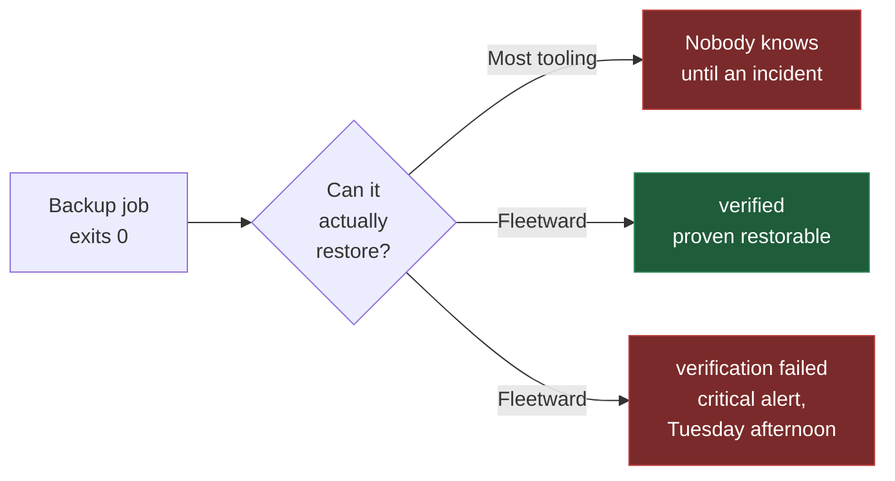
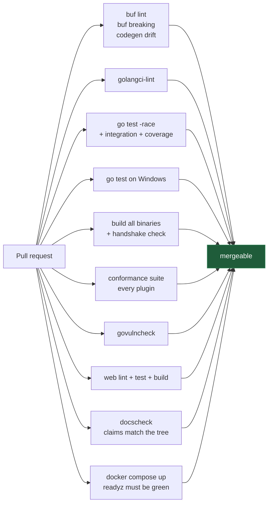

<div align="center">

# Fleetward

**A multi-engine DBA operations control plane — with backups that prove themselves.**

[](https://github.com/danmorcov88/Fleetward/actions/workflows/ci.yml)
[](LICENSE)
[](https://go.dev)
[](api/proto/fleetward/v1/plugin.proto)
[](docs/dev/STATUS.md)

[Why](docs/why.md) · [Architecture](docs/architecture.md) · [Engines](docs/engines.md) · [Quickstart](#quickstart) · [Roadmap](docs/roadmap.md) · [Contributing](.github/CONTRIBUTING.md)

</div>

---

## Why Fleetward

Most backup tooling reports success when a *backup job* exits zero. That is not the same thing as
having a **restorable** backup, and the gap between those two facts is where data loss lives.

Fleetward closes it. Every backup can be automatically restored into a throwaway container of the
matching engine and version, then smoke-tested against a manifest captured at backup time. The
result is a first-class state, not a footnote.



A backup that succeeded but failed verification is surfaced as **critical** — louder than having no
backup at all, because it is more dangerous. It is the difference between knowing you are exposed
and believing you are safe.

Fleetward exists for the DBA responsible for fifty servers who cannot physically verify all of them
in a working week. It reads the backups your existing cron and scripts already take, so it reports
on the whole estate from day one without you migrating anything — and the backups it takes itself
carry a manifest that makes full verification possible. The two are never shown as the same green
checkmark.

**More:** [why Fleetward exists](docs/why.md) · [how it is built](docs/architecture.md) ·
[which engines](docs/engines.md)

---

## Quickstart

Requires **Docker** and **Docker Compose** to run the stack. The CLI steps further down build from
source, which needs **Go 1.25+** — or use the `fleetward-cli` already inside the control-plane
container, via `docker compose exec fleetward fleetward-cli …`.

```bash
git clone https://github.com/danmorcov88/Fleetward.git
cd Fleetward
make dev
```

That brings up the full stack — control plane, PostgreSQL, VictoriaMetrics, MinIO, Dex, and the web
UI, plus a SQL Server instance for Fleetward to watch.

| Service | URL | Credentials |
|---|---|---|
| Web UI | <http://localhost:3000> | — |
| Control plane API | <http://localhost:8080> | — |
| MinIO console | <http://localhost:9001> | `fleetward` / `fleetward-dev-secret` |
| Dex (OIDC) | <http://localhost:5556/dex> | `admin@fleetward.local` / `admin` |

Check it is live:

```bash
curl -s localhost:8080/readyz | jq
```

```json
{
  "status": "healthy",
  "components": [
    { "name": "metadb",   "status": "healthy", "critical": true,  "latency_ms": 8 },
    { "name": "objstore", "status": "healthy", "critical": false, "latency_ms": 14 },
    { "name": "plugins",  "status": "healthy", "critical": false, "latency_ms": 8 },
    { "name": "secrets",  "status": "healthy", "critical": true,  "latency_ms": 21 },
    { "name": "tsdb",     "status": "healthy", "critical": false, "latency_ms": 10 }
  ]
}
```

`/healthz` is liveness and touches nothing external — a restart cannot fix an unreachable database,
and restart loops during a brief outage make everything worse. `/readyz` is readiness and does check
dependencies. Only the metadata store and secrets provider are critical; the rest degrade readiness
rather than failing it, so a MinIO outage does not take the estate view offline.

> **Port already in use?** Every published port is overridable. Copy [`.env.example`](.env.example)
> to `.env` and change what collides — developer machines routinely already run a Postgres or a
> MinIO.

> [!WARNING]
> The compose stack is **development configuration**. Every credential in it is published in this
> repository, TLS is disabled on every listener, and authentication is off by default. Never expose
> it to a network you do not fully control. See [SECURITY.md](.github/SECURITY.md).

### Add your first server

```bash
make build-cli

bin/fleetward-cli environment add production --production

FLEETWARD_DB_PASSWORD=… bin/fleetward-cli instance add prod-1 \
  --environment production \
  --engine postgresql \
  --host db.example.internal --port 5432 \
  --username fleetward --database app

bin/fleetward-cli instance health prod-1
```

```
prod-1  UP
  endpoint   db.example.internal:5432
  version    16.2
  latency    3.1ms
  signal     connection_usage       INFO 4%
```

`instance discover prod-1` then fills in the topology, the version, and the databases with their
sizes and owners; `instance list` shows the estate.

There is deliberately **no `--password` flag**. The password comes from `FLEETWARD_DB_PASSWORD` or
from `--password-stdin`, because a password in a command line is visible to every process on the host
through `ps` and is kept in the shell history of whoever typed it.

The CLI is a REST client and nothing more — it never opens a connection to the metadata store. A CLI
holding that password would put it on every operator's laptop and would duplicate authorization in a
second place.

The same operations over HTTP, since the API is the only interface either client uses:

```bash
curl -sS -X POST localhost:8080/api/v1/environments \
  -H 'content-type: application/json' \
  -d '{"name":"production","is_production":true}' | jq

curl -sS localhost:8080/api/v1/instances | jq
```

Credentials go in and never come back out. The password is encrypted by the `SecretsProvider`
([ADR-0009](docs/adr/0009-secrets-provider-interface.md)) and stored apart from everything else about
the connection; `ConnectionSpec` is inbound-only, and no read path has a field that could return it.

### Take a backup

```bash
bin/fleetward-cli backup run --instance prod-1
```

```
backup 99946af5-d519-44f6-8372-6a7279b9f52b started on prod-1
  running
  succeeded
id             99946af5-d519-44f6-8372-6a7279b9f52b
state          SUCCEEDED
method         pg_dump
artifact       fleetward-backups/tenants/…/backups/99946af5-…/artifact
size           66.9 KiB
checksum       SHA256 de833d41846a7489d917493d3d6b228a0807e088573bb5a1d92eae7c8d68306f
duration       0.406s
consistent to  2026-08-29T13:54:11Z
manifest       19 objects, 12 records
```

The `manifest` line is the point. It records what the source actually contained at the moment the
artifact was taken — counted inside the same exported snapshot the dump reads, so the two can never
describe different moments. `backup show <id> --manifest` lists every object and its record count.
Without it, "verification" would mean nothing more than "the restore command exited zero".

`backup run` starts the backup and follows it; the run itself happens in the control plane, so
`--wait=false` returns immediately and `backup show` picks it up later.

### Prove it can be restored

```bash
bin/fleetward-cli backup verify --backup 99946af5-d519-44f6-8372-6a7279b9f52b
```

```
verification 4b1e0c72-8f3a-4d5e-b6c7-1a2b3c4d5e6f started for backup 99946af5-…
id        4b1e0c72-8f3a-4d5e-b6c7-1a2b3c4d5e6f
backup    99946af5-d519-44f6-8372-6a7279b9f52b
status    VERIFIED
duration  24.8s

CHECK            RESULT  DETAIL
connectivity     pass    the restored instance accepts connections and reports version 16.2
schema_presence  pass    all 19 objects the manifest recorded are present
record_counts    pass    12 rows across 19 objects match the manifest exactly
```

Fleetward pulls a container of the engine version **that produced the artifact** — not the version
the instance runs today, because an instance can be upgraded between a backup and its verification —
restores into it, counts what arrived with the very same code that counted the source, and destroys
the container on every path out, including a panic.

Three outcomes are possible, and they are deliberately different answers:

| Status | Meaning |
|---|---|
| `VERIFIED` | The restored copy matches the manifest, object for object and row for row |
| `FAILED` | It does not. This backup is not what it claims to be — the loudest thing Fleetward reports |
| `INCONCLUSIVE` | The question could not be answered: the sandbox never started, the image could not be pulled, the backup carries no manifest |

That third status exists because reporting an infrastructure problem as data loss trains an operator
to ignore the one alert that matters most. A backup with no manifest is inconclusive by construction
and never even reaches a sandbox: comparing zero objects to zero objects would succeed trivially.

When a check fails, the report names the objects rather than the fact:

```
record_counts discrepancies:
OBJECT           EXPECTED  FOUND  DETAIL
public.orders    120       118    the restored copy holds a different number of rows
```

`backup run --verify` chains the two, and `backup show` then carries the two-part status — the
backup and its proof are separate facts, and a green backup with a red verification is the case the
whole product exists to surface.

### Stop asking

Everything above was typed by a person. On fifty servers that does not scale, so a schedule declares
the intent once and the control plane does it:

```bash
bin/fleetward-cli schedule create --instance prod-1   --cron "0 2 * * *" --timezone Europe/Bucharest --verify always
```

```
schedule 7c2f18ab-4d90-4e21-9f55-2b6e0c3a71d4 created on prod-1
  0 2 * * * in Europe/Bucharest — next run 2026-09-03 00:00:00
```

The cron expression is read **in the schedule's own timezone** and stored in UTC, so `0 2 * * *`
means 02:00 in Bucharest in July as well as in January. What actually ran is a table of its own:

```bash
bin/fleetward-cli job list --instance prod-1
```

```
ID        KIND    STATE      TRIGGER   ATTEMPTS  STARTED (UTC)        FINISHED (UTC)       ERROR
1f0c…     verify  succeeded  schedule  1         2026-09-03 00:00:31  2026-09-03 00:01:04
9ab3…     backup  succeeded  schedule  1         2026-09-03 00:00:02  2026-09-03 00:00:29
```

The verification is a **separate job**, not something chained invisibly onto the backup — so
`--verify sampled --verify-percent 20` is a decision you can read back out of that table later.

The clock is a column in the database rather than a timer in the process, which is what makes the
next two things true. A control plane restarted at 01:59 still runs the 02:00 backup. And a control
plane killed **during** a backup does not leave a row saying `running` forever: within one lease
period the job is closed as failed, with a message saying what happened, and the next scheduled run
proceeds normally ([ADR-0025](docs/adr/0025-an-expired-lease-fails-its-job.md)).

Two control planes against one database are safe by construction: a job is claimed by a single
atomic `UPDATE`, so exactly one of them gets it.

**More:** [scheduling, leases, and what daylight saving does](docs/ops/scheduling.md).

---

### Report on the backups you already take

Everything above assumes Fleetward takes the backup. On an estate that already backs itself up — by
cron, by scripts, by tooling that predates Fleetward — that is the wrong place to start, because it
demands the riskiest possible change to production before delivering anything.

So point Fleetward at a server, declare when its backup is supposed to happen, and change nothing:

```bash
bin/fleetward-cli schedule create --instance prod-2 --kind observe   --cron "*/30 * * * *" --expect-cron "0 2 * * *" --expect-grace 2h
bin/fleetward-cli backup adherence
```

```
INSTANCE  ENGINE      EXPECTED     GRACE  LAST BACKUP (UTC)    ADHERENCE
prod-1    sqlserver   0 2 * * *    2h     2026-09-02 02:07:11  adherent
prod-2    postgresql  0 2 * * *    2h     2026-08-24 02:03:55  missed
prod-3    postgresql  —            —      2026-09-02 02:01:02  not_declared
```

Nothing was installed on those servers, no credential was created, and no backup arrangement was
migrated. Fleetward read the record the engine already keeps — SQL Server's own backup history, or
the directory a `pg_dump` cron job writes into — and compared it to what you declared.

**The two origins are never shown as the same thing.** A backup Fleetward took carries a manifest
captured at backup time, so it can be restored into a container and proven. A backup it merely
observed carries none, so it can be reported and never verified, and the history says so:

```bash
bin/fleetward-cli backup history --instance prod-2
```

```
ID     ORIGIN    STATE      METHOD    FINISHED (UTC)       SIZE     VERIFIED
b41c…  observed  unknown    file      2026-09-02 02:03:55  1.4 GiB  n/a — not ours
9ab3…  managed   succeeded  pg_dump   2026-09-01 00:00:29  1.4 GiB  verified
```

`unknown` is not a hedge, it is the honest ceiling of a directory listing: a truncated dump leaves a
file behind exactly as a complete one does. An engine that keeps its own backup record can prove
more, and says so. What each engine can and cannot establish is in
[docs/engines.md](docs/engines.md#what-each-engine-can-see-of-backups-it-did-not-take).

**More:** [observed and managed backups](docs/adr/0015-observed-and-managed-backups.md).

### See the whole estate at once

Everything above is one server at a time, which is fine for one server. The problem this product
exists for is fifty of them, and a command per server is not a surface — so open
<http://localhost:3000>.

| Instance | Health | Backup | Verified |
|---|---|---|---|
| **prod-1** · sqlserver | healthy · 2m ago | adherent — last 6h ago | **verification failed** |
| **prod-2** · postgresql | healthy · 3m ago | missed — last 9d ago | — |
| **prod-3** · postgresql | down · 4h ago | adherent — last 5h ago | n/a — not ours |
| **prod-4** · postgresql | healthy · 1m ago | nothing declared — last 2h ago | never verified |

Four columns, and the order is the argument. **A backup that succeeded and failed verification sits
at the top** — above one that never happened — because a backup believed good and proven bad is the
more dangerous of the two. An instance nobody has declared an expectation for is next, because on an
estate of fifty "nobody has said what this one's backups should look like" is a finding rather than
a blank.

Origin has no column of its own. For a reader scanning fifty rows it decides exactly one thing —
whether a verification is possible at all — so it is what the Verified cell *says*: `n/a — not ours`
for a backup Fleetward did not take, `never verified` for one it did and has not yet proven. Those
are different facts, and a screen that rendered the first as the second would send you looking for a
verification that is never coming.

Everything that weakens an answer is behind the row: the declared schedule, the grace period, and
the caveats the plugin reported — an approximate timestamp, or a source that assigns no identity so
a renamed file looks like a new backup.

The health column moves on its own, and shows how old its answer is:

```bash
bin/fleetward-cli schedule create --instance prod-1 --kind discovery --cron "*/5 * * * *"
```

The page refetches every thirty seconds. It is a poll rather than a stream, deliberately: fifty rows
on that cadence is a polling problem, and it reads nothing from your databases that the schedule
above has not already collected.

> The screen reports and changes nothing. Adding a server, editing a schedule and triggering a
> backup are CLI-only, and there is no login — every API route is open to anyone who can reach the
> port, so the UI says nothing about who is looking at it.

---

### Stop paying for backups from last spring

A schedule declares how long its backups are kept, and Fleetward now acts on it:

```bash
bin/fleetward-cli schedule create --instance prod-1 --cron "0 2 * * *" --retention-days 14
bin/fleetward-cli backup retention
```

```
retention runs every 1h0m0s, keeps at least 1 recent backup(s) per instance, and deletes at most 500 artifacts per sweep

WOULD BE DELETED (2, 2.8 GiB)
INSTANCE  BACKUP    FINISHED (UTC)       EXPIRED (UTC)        SIZE
prod-1    9f2c…3a1  2026-07-20 02:04:11  2026-08-19 02:04:11  1.4 GiB
prod-1    a71e…88d  2026-07-21 02:03:55  2026-08-20 02:03:55  1.4 GiB

PAST ITS RETENTION AND KEPT ANYWAY (1)
INSTANCE  BACKUP    FINISHED (UTC)       EXPIRED (UTC)        SIZE     WHY IT STAYS
prod-3    2d81…7c4  2026-06-02 02:02:47  2026-07-02 02:02:47  980 MiB  kept: it is the most recent backup of this instance proven restorable, and deleting the last proof is worse than keeping one old artifact
```

This is the first thing Fleetward does that cannot be undone, so three rules bound it and none of
them is configurable away.

**A backup Fleetward did not take is never deleted.** Not by default, not by policy, not at all — an
observed backup is somebody else's file, and the promise that pointing Fleetward at an estate
changes nothing on it would be worthless with an exception. It is not a filter in a query somebody
could later forget: the database refuses the transition
([ADR-0030](docs/adr/0030-retention-sweeps-the-estate-and-never-deletes-a-row.md)).

**An instance's last good backup is never deleted.** Retention that is purely time-based will, on a
server whose backups have been failing for a month, delete the last one that worked — the ordinary
result of a correct implementation, and the most damaging thing this product could do. So the floor
keeps the most recent successful backup *and* the most recent one proven restorable, which on a sick
instance are not the same row
([ADR-0032](docs/adr/0032-retention-never-deletes-the-last-good-backup.md)).

**Upgrading deletes nothing.** An expiry is stamped when a backup is taken, from the retention in
force then, and never recomputed — so every backup that already exists carries none, and none is a
permanent answer. Editing `--retention-days` applies from the next backup rather than retroactively
([ADR-0031](docs/adr/0031-an-expiry-is-stamped-when-a-backup-is-taken.md)).

**More:** [retention, the floor, and what a sweep actually deletes](docs/ops/retention.md).

---

## Where to go next

| If you want to | Read |
|---|---|
| Understand the problem it solves | [docs/why.md](docs/why.md) |
| See how it is built, and the one rule that shapes it | [docs/architecture.md](docs/architecture.md) |
| Know which engines are supported, and what "supported" means | [docs/engines.md](docs/engines.md) |
| Configure it — every setting, with its default | [docs/ops/configuration.md](docs/ops/configuration.md) |
| Schedule backups and observation, and know what a crash or a DST change does | [docs/ops/scheduling.md](docs/ops/scheduling.md) |
| Know what retention deletes, and what it refuses to | [docs/ops/retention.md](docs/ops/retention.md) |
| See the metadata schema | [docs/dev/data-model.md](docs/dev/data-model.md) |
| Write a plugin for your own engine | [docs/dev/writing-an-engine-plugin.md](docs/dev/writing-an-engine-plugin.md) |
| Know what is built and what is not | [docs/dev/STATUS.md](docs/dev/STATUS.md) |
| Know what comes next, and why in that order | [docs/roadmap.md](docs/roadmap.md) |
| Understand why something is the way it is | [decision records](docs/adr/) · [design notes](docs/dev/design-notes.md) |

---

## Repository layout

```
fleetward/
├── api/
│   ├── proto/fleetward/v1/   # the contract: common, plugin, controlplane
│   ├── gen/                  # generated Go (committed — `go build` needs no buf)
│   └── openapi/              # generated OpenAPI v3, a release artifact
├── cmd/
│   ├── fleetward/            # control plane
│   ├── fleetward-cli/        # CLI
│   └── plugins/*/            # thin plugin mains
├── internal/
│   ├── config/               # env-driven configuration, shared by server and CLI
│   ├── controlplane/         # api · authn · authz · audit · identity · inventory
│   │                         # backup · sandbox · scheduler
│   ├── plugin/{manager,sdk}/ # process supervision · the plugin author's harness
│   ├── storage/              # metadb · tsdb · objstore · secrets
│   └── telemetry/            # slog + OpenTelemetry
├── plugins/*/                # engine plugin implementations
├── web/                      # React app
├── test/{conformance,e2e}/   # the shared conformance suite
├── deploy/{docker,dev}/      # container definitions, dev IdP config
├── docs/                     # ADRs, architecture, roadmap, developer guides, status
└── .github/                  # CI, contributing, security policy, templates
```

The tree above is what exists, not what is planned — `internal/controlplane/` gains `auth` and
`rbac` in B6, and a Helm chart waits on the Kubernetes sandbox provider. Directories are added by
the slice that fills them.

The repository root holds only files their tooling requires to be there. Anything with a legitimate
home elsewhere lives in that home.

---

## Development

```bash
make help              # every target
make build             # control plane, CLI, and all plugin binaries → ./bin
make test              # Go unit tests
make test-web          # the web app's tests
make conformance       # the plugin conformance suite, against every plugin
make lint              # golangci-lint + buf lint + eslint
make proto             # regenerate from api/proto — Go, OpenAPI, and the web app's types
make vuln              # govulncheck
```

Building from source needs **Go 1.25+** and **Node 22+**. `buf` is only needed if you change the
contract.

### What CI enforces



`buf breaking` guards the plugin contract against accidental breakage — it is a public interface
third parties implement. The compose job asserts the quickstart in this README actually works, so
it cannot quietly rot between releases.

---

## Project status

**Pre-alpha.** Phase A is complete: the verification loop is closed and proven on PostgreSQL, in
both directions — a corrupted artifact returns `FAILED`, and a sandbox that never answered returns
`INCONCLUSIVE`. Phase B turns that proven loop into something installable. Backups and their
verifications now run on a schedule, without anyone asking; SQL Server passes the same conformance
suite as PostgreSQL, unmodified, which is the first evidence rather than assertion that adding an
engine does not mean modifying core; Fleetward now reports on backups it did not take, so an estate
that already backs itself up gets an answer on the day it is installed; all of it is readable on
one screen, where a backup proven unrestorable is the loudest thing on the page; and artifacts that
have outlived the retention their schedule declared are now deleted, which is the first thing this
product does that cannot be undone.

Not yet built, stated plainly because a reference document should not imply otherwise: there is no
authentication, so every API route is open to anyone who can reach the port; nothing is delivered
anywhere, so a failed verification is visible only by polling; and five of the eight engines are
still binaries that only handshake.

The full list, and which slice owns each item, is in [docs/dev/STATUS.md](docs/dev/STATUS.md).

---

## What Fleetward is not

Deliberately out of scope, and staying that way:

- Our own backup engines — we orchestrate the native tools
- Our own time-series database — we use VictoriaMetrics
- BI or analytics features
- **Writing to database access control.** Fleetward reports non-compliant accounts and generates the
  remediation SQL; a human runs it. A false positive in a read-only report costs two minutes of
  review; the same false positive with execution attached revokes a service account at 3am
  ([ADR-0017](docs/adr/0017-access-compliance-read-only.md))

A SQL query client used to be on this list. It is now the final phase of the roadmap, gated on
server-side RBAC, per-execution audit, and typed confirmation against production
([ADR-0018](docs/adr/0018-query-editor-on-the-roadmap.md)). A tool holding credentials for fifty
production servers *and* executing arbitrary SQL has a materially larger blast radius than a
monitoring tool.

The ambition lives in the contract and the architecture. The discipline lives in the scope.

---

## Contributing

Engine plugins are the most valuable contribution you can make, and the conformance suite exists so
that yours can be trusted without archaeology.

- [Contributing guide](.github/CONTRIBUTING.md) — workflow, Conventional Commits, test policy
- [Writing an engine plugin](docs/dev/writing-an-engine-plugin.md)
- [Architecture decisions](docs/adr/) — read before proposing a change to one
- [Security policy](.github/SECURITY.md) — **never** report a vulnerability as a public issue

## License

[Apache License 2.0](LICENSE) — see [`LICENSE`](LICENSE).
