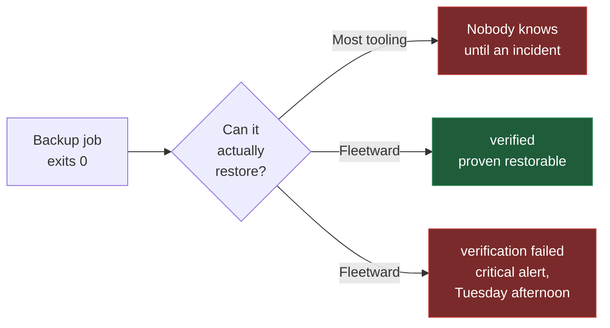
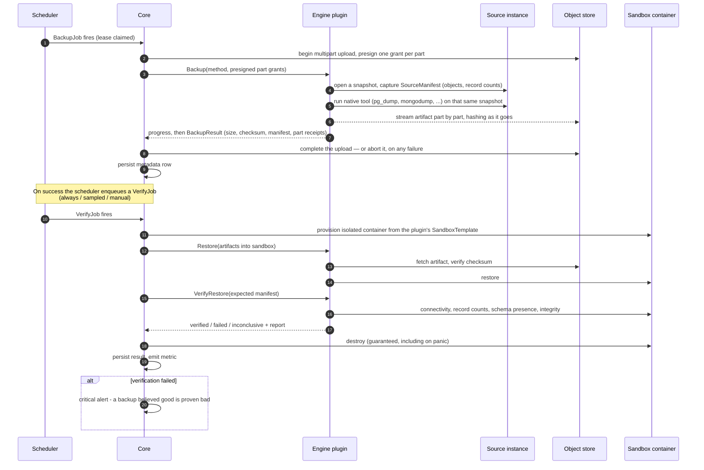
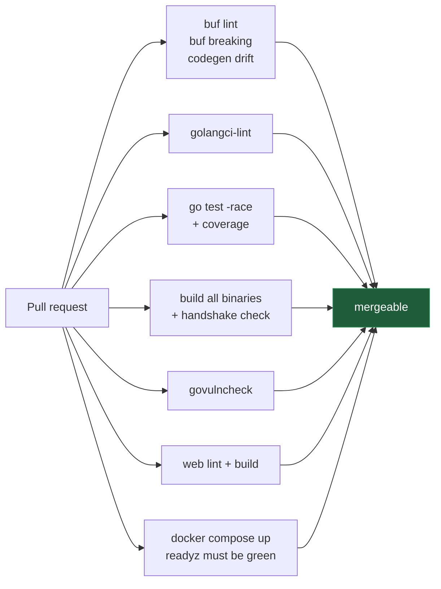

<div align="center">

# Fleetward

**A multi-engine DBA operations control plane — with backups that prove themselves.**

[](https://github.com/danmorcov88/Fleetward/actions/workflows/ci.yml)
[](LICENSE)
[](https://go.dev)
[](api/proto/fleetward/v1/plugin.proto)
[](docs/dev/STATUS.md)

[Why](#why-fleetward) · [Architecture](#architecture) · [Verification](#the-backup-verification-flow) · [Quickstart](#quickstart) · [Engines](#supported-engines) · [Contributing](.github/CONTRIBUTING.md)

</div>

---

## Why Fleetward

Most backup tooling reports success when a *backup job* exits zero. That is not the same thing as
having a **restorable** backup, and the gap between those two facts is where data loss lives.

Fleetward closes it. Every backup can be automatically restored into a throwaway container of the
matching engine and version, then smoke-tested against a manifest captured at backup time. The
result is a first-class state, not a footnote.



A backup that succeeded but failed verification is surfaced as **critical** — louder than having no
backup at all, because it is more dangerous. It is the difference between knowing you are exposed
and believing you are safe.

### Built for an estate you cannot check by hand

Fleetward exists for the DBA responsible for fifty servers who cannot physically verify all of them
in a working week. Three questions, one shape — *declare what should be true, detect what actually
is, show the gap*:

| Pillar | The question it answers |
|---|---|
| **Backup compliance** | Did every server's backup run on schedule, succeed, and is it restorable? |
| **Access compliance** | Who has access, does their account expire, and who is non-compliant? |
| **Structural drift** | Did the schema change in a way nobody intended? |

Backups already taken by your existing cron and scripts are read as **observed** backups, so
Fleetward reports on your whole estate from day one without you migrating anything. Backups it takes
itself are **managed**, and only those carry a manifest that makes full verification possible —
the two are never shown as the same green checkmark
([ADR-0015](docs/adr/0015-observed-and-managed-backups.md)).

---

## Architecture

Fleetward is a Go control plane that talks to **engine plugins**: separate binaries, each speaking a
versioned gRPC contract, launched and supervised by a plugin manager.


### The one rule that shapes everything

> **Core branches on a plugin's declared capabilities — never on its engine name.**

Adding SQL Server, Oracle, or ClickHouse means writing a plugin. It never means
modifying core. If core would need to know that an instance is PostgreSQL in order to behave
correctly, the missing information belongs in the capability matrix.

That constraint is enforced structurally rather than by convention. `SandboxTemplate` — the image,
tag, port, and readiness probe used to verify a restore — lives *inside* `Capabilities`, so the
control plane provisions verification containers from what a plugin declares and never needs a
lookup table of engines. Even the sandbox's credentials keep the rule: core generates a fresh
username, password, and database name, and the plugin's template says where they belong by writing
`{{ .Password }}` where its engine expects one ([ADR-0020](docs/adr/0020-sandbox-credentials-from-template-placeholders.md)).

Architecture decisions are recorded in [`docs/adr/`](docs/adr/) — 20 of them, each with context,
consequences, and the alternatives that were rejected.

---

## The backup verification flow

This is the product. Correctness here outranks everything else.



Three details that matter more than they look:

**The manifest is not optional.** Without record counts captured at backup time, "verification"
degrades to *did the server start* — and shipping that under the same green checkmark as a real
check is worse than shipping no check at all.

**`FAILED` and `INCONCLUSIVE` are different states.** A sandbox that never became ready is an
infrastructure problem, not data loss. Collapsing them would train operators to ignore the one
alert that matters most.

**A partial artifact never becomes an object.** The plugin holds no storage credential: it writes
parts through presigned grants and reports their receipts, and only core completes the upload
([ADR-0021](docs/adr/0021-plugins-upload-artifacts-as-multipart-parts.md)). A backup that fails half
way is aborted, so there is no window in which a truncated artifact exists to be restored later.

**The sandbox is always destroyed.** Guaranteed teardown on every path, including panic — and
defended twice more behind that, because a leaked container breaks nothing until it has eaten the
machine. A lifetime ceiling reaps a verification that hung rather than failed, and a label-driven
sweep at startup removes whatever a control plane killed mid-verification left behind.

---

## Supported engines

| Engine | Backup method | Status |
|---|---|---|
| **PostgreSQL** | `pg_dump` today; `pg_basebackup` + WAL archiving next, `pgbackrest` as a later method | Reference plugin — health, discovery, backup, sandbox restore, and verification implemented |
| **MySQL / MariaDB** | `xtrabackup`, with `mysqldump` shipping first | Stage 3 |
| **MongoDB** | `mongodump`, snapshot-based to follow | Stage 3 |
| **Redis** | RDB via `BGSAVE` + fetch, AOF expressed in capabilities | Stage 3 |
| SQL Server · Oracle · ClickHouse | — | Phase E — in the target estate, so the multi-engine architecture is a requirement, not a thought experiment |

Fleetward orchestrates native tooling rather than implementing backup formats. Your engine's
maintainers have spent years on those tools; the value is in scheduling, verifying, and reporting
on them.

---

## Quickstart

Requires **Docker** and **Docker Compose**. Nothing else.

```bash
git clone https://github.com/danmorcov88/Fleetward.git
cd Fleetward
make dev
```

That brings up the full stack — control plane, PostgreSQL, VictoriaMetrics, MinIO, Dex, and the web
UI.

| Service | URL | Credentials |
|---|---|---|
| Web UI | <http://localhost:3000> | — |
| Control plane API | <http://localhost:8080> | — |
| MinIO console | <http://localhost:9001> | `fleetward` / `fleetward-dev-secret` |
| Dex (OIDC) | <http://localhost:5556/dex> | `admin@fleetward.local` / `admin` |

Check it is live:

```bash
curl -s localhost:8080/readyz | jq
```

```json
{
  "status": "healthy",
  "components": [
    { "name": "metadb",   "status": "healthy", "critical": true,  "latency_ms": 8 },
    { "name": "objstore", "status": "healthy", "critical": false, "latency_ms": 14 },
    { "name": "plugins",  "status": "healthy", "critical": false, "latency_ms": 8 },
    { "name": "secrets",  "status": "healthy", "critical": true,  "latency_ms": 21 },
    { "name": "tsdb",     "status": "healthy", "critical": false, "latency_ms": 10 }
  ]
}
```

`/healthz` is liveness and touches nothing external — a restart cannot fix an unreachable database,
and restart loops during a brief outage make everything worse. `/readyz` is readiness and does check
dependencies. Only the metadata store and secrets provider are critical; the rest degrade readiness
rather than failing it, so a MinIO outage does not take the estate view offline.

> **Port already in use?** Every published port is overridable. Copy [`.env.example`](.env.example)
> to `.env` and change what collides — developer machines routinely already run a Postgres or a
> MinIO.

> [!WARNING]
> The compose stack is **development configuration**. Every credential in it is published in this
> repository, TLS is disabled on every listener, and authentication is off by default. Never expose
> it to a network you do not fully control. See [SECURITY.md](.github/SECURITY.md).

### Add your first server

```bash
make build-cli

bin/fleetward-cli environment add production --production

FLEETWARD_DB_PASSWORD=… bin/fleetward-cli instance add prod-1 \
  --environment production \
  --engine postgresql \
  --host db.example.internal --port 5432 \
  --username fleetward --database app

bin/fleetward-cli instance health prod-1
```

```
prod-1  UP
  endpoint   db.example.internal:5432
  version    16.2
  latency    3.1ms
  signal     connection_usage       INFO 4%
```

`instance discover prod-1` then fills in the topology, the version, and the databases with their
sizes and owners; `instance list` shows the estate.

There is deliberately **no `--password` flag**. The password comes from `FLEETWARD_DB_PASSWORD` or
from `--password-stdin`, because a password in a command line is visible to every process on the host
through `ps` and is kept in the shell history of whoever typed it.

The CLI is a REST client and nothing more — it never opens a connection to the metadata store. A CLI
holding that password would put it on every operator's laptop and would duplicate authorization in a
second place.

The same operations over HTTP, since the API is the only interface either client uses:

```bash
curl -sS -X POST localhost:8080/api/v1/environments \
  -H 'content-type: application/json' \
  -d '{"name":"production","is_production":true}' | jq

curl -sS localhost:8080/api/v1/instances | jq
```

Credentials go in and never come back out. The password is encrypted by the `SecretsProvider`
([ADR-0009](docs/adr/0009-secrets-provider-interface.md)) and stored apart from everything else about
the connection; `ConnectionSpec` is inbound-only, and no read path has a field that could return it.

### Take a backup

```bash
bin/fleetward-cli backup run --instance prod-1
```

```
backup 99946af5-d519-44f6-8372-6a7279b9f52b started on prod-1
  running
  succeeded
id             99946af5-d519-44f6-8372-6a7279b9f52b
state          SUCCEEDED
method         pg_dump
artifact       fleetward-backups/tenants/…/backups/99946af5-…/artifact
size           66.9 KiB
checksum       SHA256 de833d41846a7489d917493d3d6b228a0807e088573bb5a1d92eae7c8d68306f
duration       0.406s
consistent to  2026-08-29T13:54:11Z
manifest       19 objects, 12 records
```

The `manifest` line is the point. It records what the source actually contained at the moment the
artifact was taken — counted inside the same exported snapshot the dump reads, so the two can never
describe different moments. `backup show <id> --manifest` lists every object and its record count.
Without it, "verification" would mean nothing more than "the restore command exited zero".

`backup run` starts the backup and follows it; the run itself happens in the control plane, so
`--wait=false` returns immediately and `backup show` picks it up later.

### Prove it can be restored

```bash
bin/fleetward-cli backup verify --backup 99946af5-d519-44f6-8372-6a7279b9f52b
```

```
verification 4b1e0c72-8f3a-4d5e-b6c7-1a2b3c4d5e6f started for backup 99946af5-…
id        4b1e0c72-8f3a-4d5e-b6c7-1a2b3c4d5e6f
backup    99946af5-d519-44f6-8372-6a7279b9f52b
status    VERIFIED
duration  24.8s

CHECK            RESULT  DETAIL
connectivity     pass    the restored instance accepts connections and reports version 16.2
schema_presence  pass    all 19 objects the manifest recorded are present
record_counts    pass    12 rows across 19 objects match the manifest exactly
```

Fleetward pulls a container of the engine version **that produced the artifact** — not the version
the instance runs today, because an instance can be upgraded between a backup and its verification —
restores into it, counts what arrived with the very same code that counted the source, and destroys
the container on every path out, including a panic.

Three outcomes are possible, and they are deliberately different answers:

| Status | Meaning |
|---|---|
| `VERIFIED` | The restored copy matches the manifest, object for object and row for row |
| `FAILED` | It does not. This backup is not what it claims to be — the loudest thing Fleetward reports |
| `INCONCLUSIVE` | The question could not be answered: the sandbox never started, the image could not be pulled, the backup carries no manifest |

That third status exists because reporting an infrastructure problem as data loss trains an operator
to ignore the one alert that matters most. A backup with no manifest is inconclusive by construction
and never even reaches a sandbox: comparing zero objects to zero objects would succeed trivially.

When a check fails, the report names the objects rather than the fact:

```
record_counts discrepancies:
OBJECT           EXPECTED  FOUND  DETAIL
public.orders    120       118    the restored copy holds a different number of rows
```

`backup run --verify` chains the two, and `backup show` then carries the two-part status — the
backup and its proof are separate facts, and a green backup with a red verification is the case the
whole product exists to surface.

---

## The plugin contract

[`api/proto/fleetward/v1/plugin.proto`](api/proto/fleetward/v1/plugin.proto) defines ten RPCs that
every engine plugin implements:

| RPC | Purpose |
|---|---|
| `GetCapabilities` | Typed feature matrix — the only thing core branches on |
| `Discover` | Topology, version, databases |
| `GetConfig` | Normalized key/value plus the raw form |
| `CollectMetrics` | Streams batches, named per OTel database semantic conventions |
| `Backup` | Streams progress; writes the artifact via presigned URL |
| `Restore` | Streams progress; into a sandbox or a real instance |
| `VerifyRestore` | Smoke-tests a restored instance against the source manifest |
| `ListPITRTargets` | The point-in-time-recovery window, with its gaps |
| `ListPrincipals` | Users, roles, privileges — strictly read-only |
| `HealthCheck` | Liveness and health signals |

### Non-negotiable rules

1. **Capability-driven, never name-driven.** Grepping for `"postgres"` in `internal/` or `web/` is
   a code smell and almost always a bug.
2. **Plugins never persist credentials.** They arrive per-request and must not outlive the call.
   Artifacts move through presigned URLs, so no storage credential ever reaches a plugin.
3. **Plugins orchestrate native tooling.** They declare what they shell out to, and the manager
   reports a missing binary at startup rather than at 3am.
4. **Conformance is the merge gate.** A plugin merges only when the shared suite passes. It stands
   your engine up from your own `SandboxTemplate`, backs it up, restores it, verifies it — and then
   corrupts the artifact in the bucket and requires you to say so. Four of its end-to-end cases are
   failures rather than successes, because a verification that has only ever been shown to pass is
   indistinguishable from one that always passes.

### Writing your own

An engine plugin is a standalone binary whose `main` is three lines:

```go
package main

import (
    "github.com/danmorcov88/fleetward/internal/plugin/sdk"
    "github.com/danmorcov88/fleetward/plugins/mynewengine"
)

func main() {
    sdk.Serve(mynewengine.New())
}
```

Embedding `sdk.Base` supplies typed "not supported" answers for everything you have not written
yet, so the plugin satisfies the contract at every point in its construction rather than only at
the end.

Full guide: [**writing an engine plugin**](docs/dev/writing-an-engine-plugin.md).

---

## Repository layout

```
fleetward/
├── api/
│   ├── proto/fleetward/v1/   # the contract: common, plugin, controlplane
│   ├── gen/                  # generated Go (committed — `go build` needs no buf)
│   └── openapi/              # generated OpenAPI v3, a release artifact
├── cmd/
│   ├── fleetward/            # control plane
│   ├── fleetward-cli/        # CLI
│   └── plugins/*/            # thin plugin mains
├── internal/
│   ├── config/               # env-driven configuration, shared by server and CLI
│   ├── controlplane/         # api, inventory, scheduler, backup, alerting, rbac, auth
│   ├── plugin/{manager,sdk}/ # process supervision · the plugin author's harness
│   ├── storage/              # metadb · tsdb · objstore · secrets
│   └── telemetry/            # slog + OpenTelemetry
├── plugins/*/                # engine plugin implementations
├── web/                      # React app
├── test/{conformance,e2e}/   # the shared conformance suite
├── deploy/{docker,dev,helm}/ # container definitions, dev IdP config
├── docs/{adr,dev}/           # 23 ADRs, developer guides, project status
└── .github/                  # CI, contributing, security policy, templates
```

The repository root holds only files their tooling requires to be there. Anything with a legitimate
home elsewhere lives in that home.

---

## Development

```bash
make help              # every target
make build             # control plane, CLI, and all plugin binaries → ./bin
make test              # unit tests
make conformance       # the plugin conformance suite, against every plugin
make lint              # golangci-lint + buf lint + eslint
make proto             # regenerate from api/proto
make vuln              # govulncheck
```

Building from source needs **Go 1.25+** and **Node 22+**. `buf` is only needed if you change the
contract.

### What CI enforces



`buf breaking` guards the plugin contract against accidental breakage — it is a public interface
third parties implement. The compose job asserts the quickstart in this README actually works, so
it cannot quietly rot between releases.

---

## Project status

**Pre-alpha — Phase A complete, starting Phase B.** The contract, plugin system, metadata schema,
dev stack, and CI are in place and verified end to end. Work is cut into slices, each independently
demoable.

Phase A is done. The PostgreSQL plugin answers `HealthCheck` and `Discover` against a real server;
the inventory service, REST API, and CLI make that reachable, so a server can be added and seen
healthy; the control plane provisions a throwaway database container from a plugin's
`SandboxTemplate` and is proven not to leak one; `backup run` takes a real `pg_dump`, streams it
into object storage without buffering it, and records a manifest of what the source contained; and
`backup verify` restores that artifact into the sandbox and compares it to the manifest row for row.

**The loop is closed, and it is proven in both directions.** An artifact corrupted where it lives —
truncated in the bucket, or with one byte flipped mid-stream — comes back `FAILED` rather than
restoring quietly. A restored copy that is short of what its manifest recorded comes back `FAILED`
with the object and both counts named. And a sandbox that never answered comes back `INCONCLUSIVE`,
never `FAILED`, because a system that reports infrastructure trouble as data loss gets muted, and a
muted alert is the same as no alert.

All of that lives in the shared plugin conformance suite rather than in a PostgreSQL test, so every
engine added later inherits the proof instead of reinventing it.

| Phase | Scope | Status |
|---|---|---|
| **Foundation** | Contract, plugin manager, schema, dev stack, CI | ✅ Complete |
| **A** | Prove the loop: PostgreSQL backup → sandbox restore → verification | ✅ Complete |
| **B** | Compliance console: observed backups, schedule adherence, Estate Overview, alerts | 🔨 Next |
| **C** | Access compliance: who has access, expiry, non-compliant accounts | ⬜ |
| **D** | Structural drift: schema snapshots and diffs over time | ⬜ |
| **E** | Remaining engines: MySQL/MariaDB, MongoDB, Redis, SQL Server, Oracle, ClickHouse | ⬜ |
| **F** | Production readiness: RBAC enforcement, audit, metrics, signed releases | ⬜ |
| **G** | Query editor — last, and gated on the conditions in ADR-0018 | ⬜ |

Detail and per-slice checklists: [`docs/dev/STATUS.md`](docs/dev/STATUS.md).

> The PostgreSQL plugin declares five capabilities today — schema discovery, replication,
> replication lag, online backup, and sandbox restore — plus the three verification checks it
> actually implements. Every other flag is still `false`. A flag is turned on in the same change
> that implements the behaviour behind it, never in advance. Core trusts that matrix when deciding
> what is safe to do to a production database, and a premature flag produces its failure during a
> recovery.

---

## What Fleetward is not

Deliberately out of scope, and staying that way:

- Our own backup engines — we orchestrate the native tools
- Our own time-series database — we use VictoriaMetrics
- BI or analytics features
- **Writing to database access control.** Fleetward reports non-compliant accounts and generates the
  remediation SQL; a human runs it. A false positive in a read-only report costs two minutes of
  review; the same false positive with execution attached revokes a service account at 3am
  ([ADR-0017](docs/adr/0017-access-compliance-read-only.md))

A SQL query client used to be on this list. It is now the final phase of the roadmap, gated on
server-side RBAC, per-execution audit, and typed confirmation against production
([ADR-0018](docs/adr/0018-query-editor-on-the-roadmap.md)). A tool holding credentials for fifty
production servers *and* executing arbitrary SQL has a materially larger blast radius than a
monitoring tool.

The ambition lives in the contract and the architecture. The discipline lives in the scope.

---

## Contributing

Engine plugins are the most valuable contribution you can make, and the conformance suite exists so
that yours can be trusted without archaeology.

- [Contributing guide](.github/CONTRIBUTING.md) — workflow, Conventional Commits, test policy
- [Writing an engine plugin](docs/dev/writing-an-engine-plugin.md)
- [Architecture decisions](docs/adr/) — read before proposing a change to one
- [Security policy](.github/SECURITY.md) — **never** report a vulnerability as a public issue

## License

[Apache License 2.0](LICENSE) — see [`LICENSE`](LICENSE).
