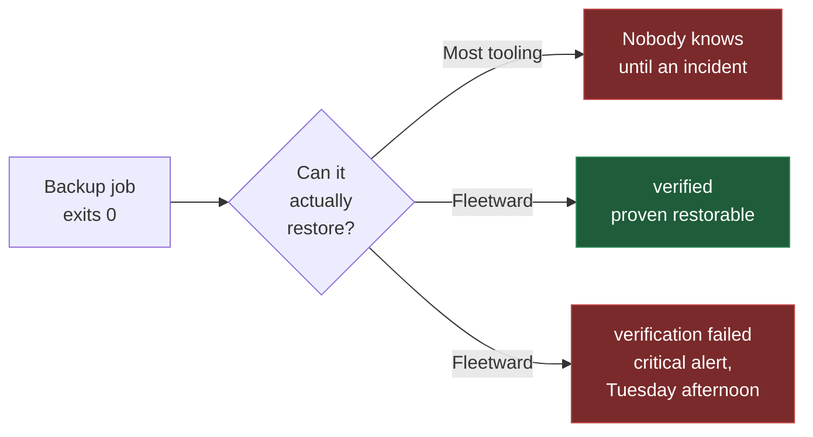
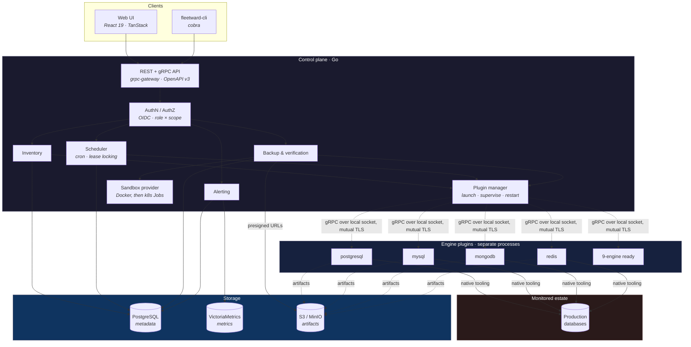
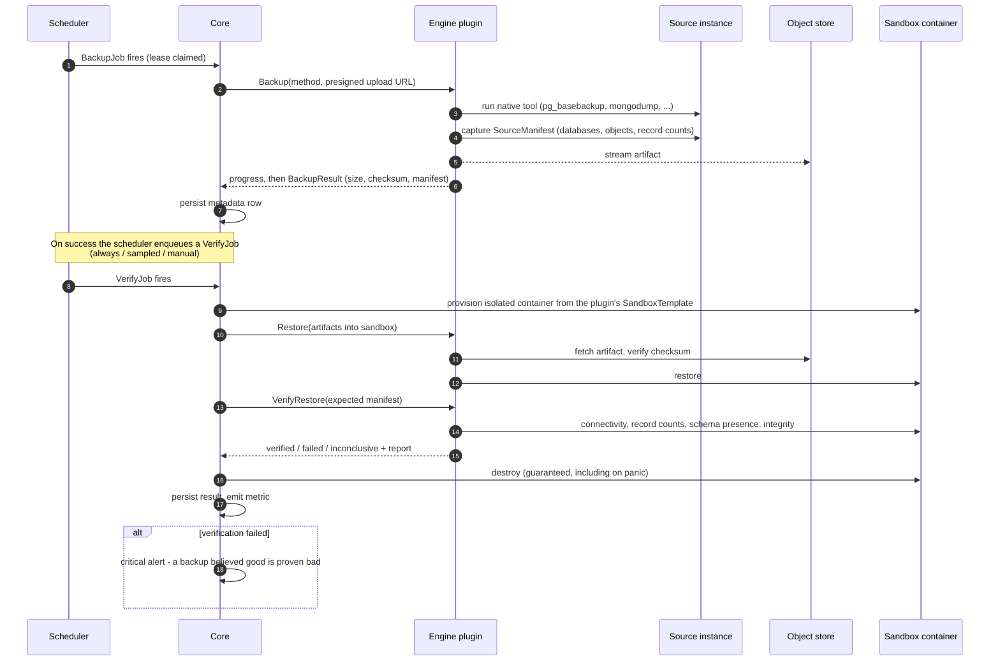
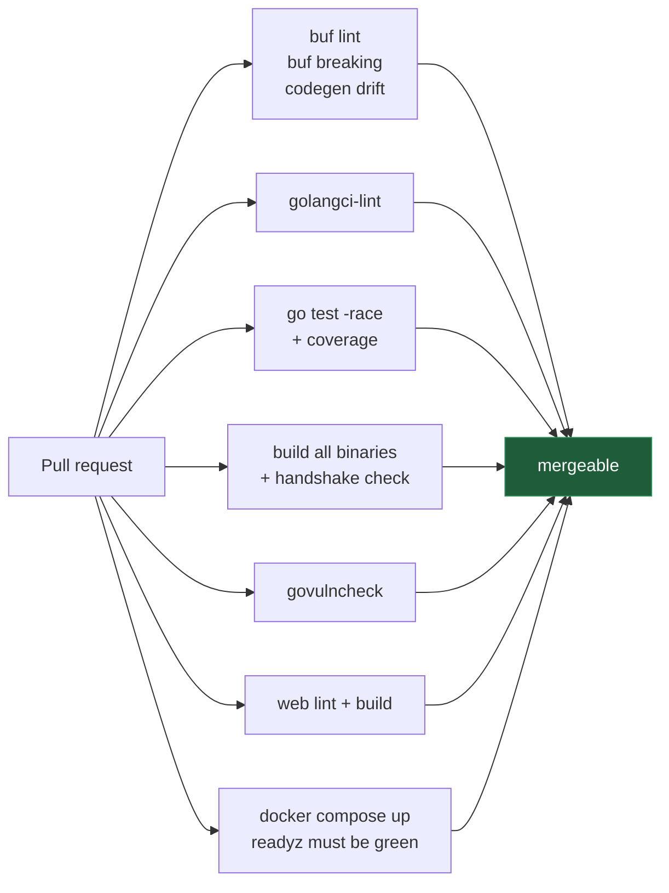

<div align="center">

# Fleetward

**A multi-engine DBA operations control plane — with backups that prove themselves.**

[](https://github.com/danmorcov88/Fleetward/actions/workflows/ci.yml)
[](LICENSE)
[](https://go.dev)
[](api/proto/fleetward/v1/plugin.proto)
[](docs/dev/STATUS.md)

[Why](#why-fleetward) · [Architecture](#architecture) · [Verification](#the-backup-verification-flow) · [Quickstart](#quickstart) · [Engines](#supported-engines) · [Contributing](.github/CONTRIBUTING.md)

</div>

---

## Why Fleetward

Most backup tooling reports success when a *backup job* exits zero. That is not the same thing as
having a **restorable** backup, and the gap between those two facts is where data loss lives.

Fleetward closes it. Every backup can be automatically restored into a throwaway container of the
matching engine and version, then smoke-tested against a manifest captured at backup time. The
result is a first-class state, not a footnote.



A backup that succeeded but failed verification is surfaced as **critical** — louder than having no
backup at all, because it is more dangerous. It is the difference between knowing you are exposed
and believing you are safe.

Beyond that, Fleetward gives DBA teams one place for estate inventory, health monitoring, access
visibility, and alerting — unified across SQL and NoSQL engines through a single strict contract.

---

## Architecture

Fleetward is a Go control plane that talks to **engine plugins**: separate binaries, each speaking a
versioned gRPC contract, launched and supervised by a plugin manager.



### The one rule that shapes everything

> **Core branches on a plugin's declared capabilities — never on its engine name.**

Adding SQL Server, Oracle, Informix, ClickHouse, or Cassandra means writing a plugin. It never means
modifying core. If core would need to know that an instance is PostgreSQL in order to behave
correctly, the missing information belongs in the capability matrix.

That constraint is enforced structurally rather than by convention. `SandboxTemplate` — the image,
tag, port, and readiness probe used to verify a restore — lives *inside* `Capabilities`, so the
control plane provisions verification containers from what a plugin declares and never needs a
lookup table of engines.

Architecture decisions are recorded in [`docs/adr/`](docs/adr/) — 14 of them, each with context,
consequences, and the alternatives that were rejected.

---

## The backup verification flow

This is the product. Correctness here outranks everything else.



Three details that matter more than they look:

**The manifest is not optional.** Without record counts captured at backup time, "verification"
degrades to *did the server start* — and shipping that under the same green checkmark as a real
check is worse than shipping no check at all.

**`FAILED` and `INCONCLUSIVE` are different states.** A sandbox that never became ready is an
infrastructure problem, not data loss. Collapsing them would train operators to ignore the one
alert that matters most.

**The sandbox is always destroyed.** Guaranteed teardown on every path, including panic.

---

## Supported engines

| Engine | Backup method | Status |
|---|---|---|
| **PostgreSQL** | `pg_basebackup` + WAL archiving (`pgbackrest` as a later method) | Stage 1 — reference plugin |
| **MySQL / MariaDB** | `xtrabackup`, with `mysqldump` shipping first | Stage 3 |
| **MongoDB** | `mongodump`, snapshot-based to follow | Stage 3 |
| **Redis** | RDB via `BGSAVE` + fetch, AOF expressed in capabilities | Stage 3 |
| SQL Server · Oracle · Informix · ClickHouse · Cassandra | — | Supported **by architecture**: a plugin, never a core change |

Fleetward orchestrates native tooling rather than implementing backup formats. Your engine's
maintainers have spent years on those tools; the value is in scheduling, verifying, and reporting
on them.

---

## Quickstart

Requires **Docker** and **Docker Compose**. Nothing else.

```bash
git clone https://github.com/danmorcov88/Fleetward.git
cd Fleetward
make dev
```

That brings up the full stack — control plane, PostgreSQL, VictoriaMetrics, MinIO, Dex, and the web
UI.

| Service | URL | Credentials |
|---|---|---|
| Web UI | <http://localhost:3000> | — |
| Control plane API | <http://localhost:8080> | — |
| MinIO console | <http://localhost:9001> | `fleetward` / `fleetward-dev-secret` |
| Dex (OIDC) | <http://localhost:5556/dex> | `admin@fleetward.local` / `admin` |

Check it is live:

```bash
curl -s localhost:8080/readyz | jq
```

```json
{
  "status": "healthy",
  "components": [
    { "name": "metadb",   "status": "healthy", "critical": true,  "latency_ms": 8 },
    { "name": "objstore", "status": "healthy", "critical": false, "latency_ms": 14 },
    { "name": "plugins",  "status": "healthy", "critical": false, "latency_ms": 8 },
    { "name": "secrets",  "status": "healthy", "critical": true,  "latency_ms": 21 },
    { "name": "tsdb",     "status": "healthy", "critical": false, "latency_ms": 10 }
  ]
}
```

`/healthz` is liveness and touches nothing external — a restart cannot fix an unreachable database,
and restart loops during a brief outage make everything worse. `/readyz` is readiness and does check
dependencies. Only the metadata store and secrets provider are critical; the rest degrade readiness
rather than failing it, so a MinIO outage does not take the estate view offline.

> **Port already in use?** Every published port is overridable. Copy [`.env.example`](.env.example)
> to `.env` and change what collides — developer machines routinely already run a Postgres or a
> MinIO.

> [!WARNING]
> The compose stack is **development configuration**. Every credential in it is published in this
> repository, TLS is disabled on every listener, and authentication is off by default. Never expose
> it to a network you do not fully control. See [SECURITY.md](.github/SECURITY.md).

---

## The plugin contract

[`api/proto/fleetward/v1/plugin.proto`](api/proto/fleetward/v1/plugin.proto) defines ten RPCs that
every engine plugin implements:

| RPC | Purpose |
|---|---|
| `GetCapabilities` | Typed feature matrix — the only thing core branches on |
| `Discover` | Topology, version, databases |
| `GetConfig` | Normalized key/value plus the raw form |
| `CollectMetrics` | Streams batches, named per OTel database semantic conventions |
| `Backup` | Streams progress; writes the artifact via presigned URL |
| `Restore` | Streams progress; into a sandbox or a real instance |
| `VerifyRestore` | Smoke-tests a restored instance against the source manifest |
| `ListPITRTargets` | The point-in-time-recovery window, with its gaps |
| `ListPrincipals` | Users, roles, privileges — strictly read-only |
| `HealthCheck` | Liveness and health signals |

### Non-negotiable rules

1. **Capability-driven, never name-driven.** Grepping for `"postgres"` in `internal/` or `web/` is
   a code smell and almost always a bug.
2. **Plugins never persist credentials.** They arrive per-request and must not outlive the call.
   Artifacts move through presigned URLs, so no storage credential ever reaches a plugin.
3. **Plugins orchestrate native tooling.** They declare what they shell out to, and the manager
   reports a missing binary at startup rather than at 3am.
4. **Conformance is the merge gate.** A plugin merges only when the shared suite passes.

### Writing your own

An engine plugin is a standalone binary whose `main` is three lines:

```go
package main

import (
    "github.com/danmorcov88/fleetward/internal/plugin/sdk"
    "github.com/danmorcov88/fleetward/plugins/mynewengine"
)

func main() {
    sdk.Serve(mynewengine.New())
}
```

Embedding `sdk.Base` supplies typed "not supported" answers for everything you have not written
yet, so the plugin satisfies the contract at every point in its construction rather than only at
the end.

Full guide: [**writing an engine plugin**](docs/dev/writing-an-engine-plugin.md).

---

## Repository layout

```
fleetward/
├── api/
│   ├── proto/fleetward/v1/   # the contract: common, plugin, controlplane
│   ├── gen/                  # generated Go (committed — `go build` needs no buf)
│   └── openapi/              # generated OpenAPI v3, a release artifact
├── cmd/
│   ├── fleetward/            # control plane
│   ├── fleetward-cli/        # CLI
│   └── plugins/*/            # thin plugin mains
├── internal/
│   ├── config/               # env-driven configuration, shared by server and CLI
│   ├── controlplane/         # api, inventory, scheduler, backup, alerting, rbac, auth
│   ├── plugin/{manager,sdk}/ # process supervision · the plugin author's harness
│   ├── storage/              # metadb · tsdb · objstore · secrets
│   └── telemetry/            # slog + OpenTelemetry
├── plugins/*/                # engine plugin implementations
├── web/                      # React app
├── test/{conformance,e2e}/   # the shared conformance suite
├── deploy/{docker,dev,helm}/ # container definitions, dev IdP config
├── docs/{adr,dev}/           # 14 ADRs, developer guides, project status
└── .github/                  # CI, contributing, security policy, templates
```

The repository root holds only files their tooling requires to be there. Anything with a legitimate
home elsewhere lives in that home.

---

## Development

```bash
make help              # every target
make build             # control plane, CLI, and all plugin binaries → ./bin
make test              # unit tests
make conformance       # the plugin conformance suite, against every plugin
make lint              # golangci-lint + buf lint + eslint
make proto             # regenerate from api/proto
make vuln              # govulncheck
```

Building from source needs **Go 1.25+** and **Node 22+**. `buf` is only needed if you change the
contract.

### What CI enforces



`buf breaking` guards the plugin contract against accidental breakage — it is a public interface
third parties implement. The compose job asserts the quickstart in this README actually works, so
it cannot quietly rot between releases.

---

## Project status

**Pre-alpha — Stage 0 (Foundation) complete.** The contract, plugin system, metadata schema, dev
stack, and CI are in place and verified end to end. The four plugin binaries handshake and declare
their identity; no engine logic yet.

| Stage | Scope | Status |
|---|---|---|
| **0** | Foundation: contract, plugin manager, schema, dev stack, CI | ✅ Complete |
| **1** | PostgreSQL reference plugin end-to-end + conformance suite | 🔜 Next |
| **2** | Metrics collection and health evaluation | ⬜ |
| **3** | MySQL/MariaDB, MongoDB, Redis plugins | ⬜ |
| **4** | Web UI against the real API | ⬜ |
| **5** | RBAC enforcement and the alerting engine | ⬜ |
| **6** | Release readiness: signed binaries, SBOM, quickstart | ⬜ |

Detail and per-stage checklists: [`docs/dev/STATUS.md`](docs/dev/STATUS.md).

> Capability flags are all `false` today. A flag is turned on in the same change that implements the
> behaviour behind it — never in advance. Core trusts that matrix when deciding what is safe to do
> to a production database, and a premature flag produces its failure during a recovery.

---

## What Fleetward is not

Deliberately out of scope, and staying that way:

- A SQL query client or GUI
- Our own backup engines — we orchestrate the native tools
- Our own time-series database — we use VictoriaMetrics
- BI or analytics features
- A Kubernetes operator (a later phase, not a non-goal)

The ambition lives in the contract and the architecture. The discipline lives in the scope.

---

## Contributing

Engine plugins are the most valuable contribution you can make, and the conformance suite exists so
that yours can be trusted without archaeology.

- [Contributing guide](.github/CONTRIBUTING.md) — workflow, Conventional Commits, test policy
- [Writing an engine plugin](docs/dev/writing-an-engine-plugin.md)
- [Architecture decisions](docs/adr/) — read before proposing a change to one
- [Security policy](.github/SECURITY.md) — **never** report a vulnerability as a public issue

## License

[Apache License 2.0](LICENSE) — see [`LICENSE`](LICENSE).
