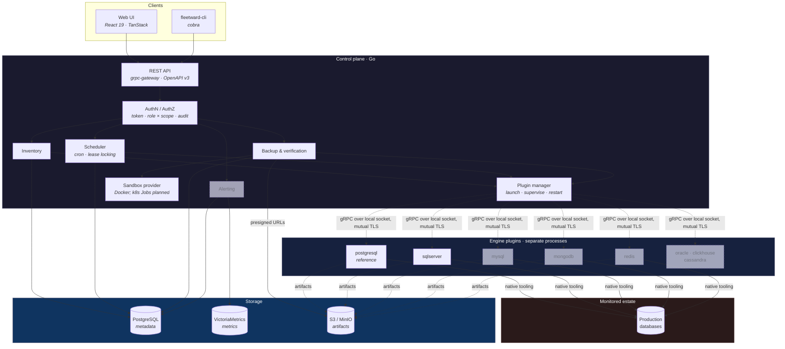
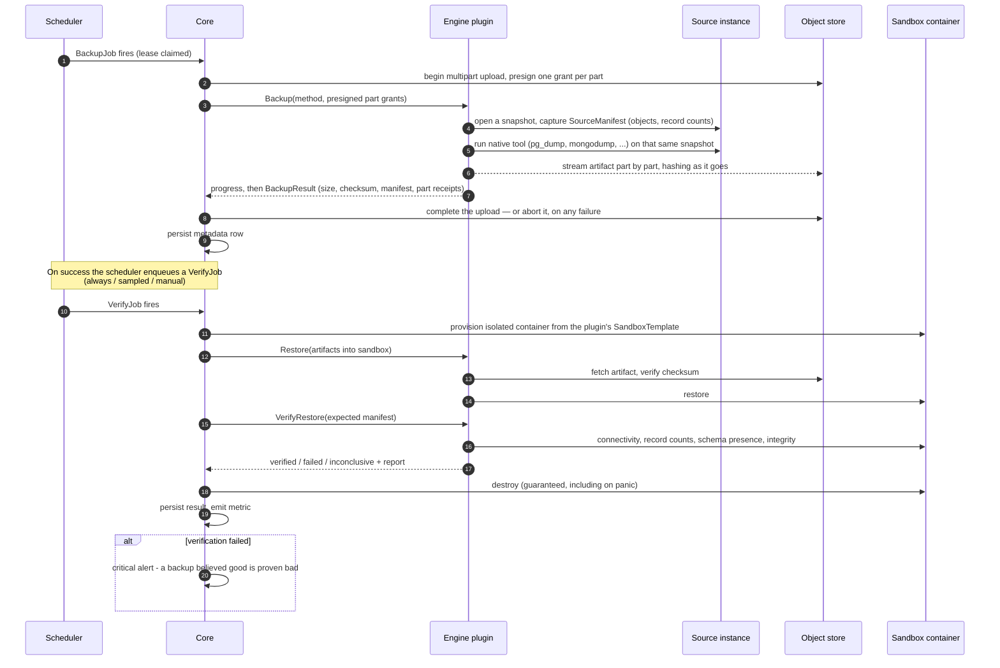

# Architecture


Fleetward is a Go control plane that talks to **engine plugins**: separate binaries, each speaking a
versioned gRPC contract, launched and supervised by a plugin manager.



**Dashed boxes are planned, not built.** Today alerting does not exist, and only the PostgreSQL and
SQL Server plugins implement anything beyond a handshake — see [`dev/STATUS.md`](dev/STATUS.md) for
what is actually running and [`roadmap.md`](roadmap.md) for when the rest arrives. The diagram is
drawn with them because the shape of the system is what the contract and the metadata schema were
designed against, and a reader deserves to see the target as well as the state.

Authorization is solid rather than dashed since B6: every request names a caller, every route
decides on that caller's role within the scope it acts on, and every mutating action lands in an
append-only record. What is not there yet is the identity provider — a caller presents an API token
or a session minted from one, and OIDC plugs into the same seam later
([ADR-0033](adr/0033-the-bootstrap-credential-is-configuration-and-never-a-row.md)).

### The one rule that shapes everything

> **Core branches on a plugin's declared capabilities — never on its engine name.**

Adding SQL Server, Oracle, or ClickHouse means writing a plugin. It never means
modifying core. If core would need to know that an instance is PostgreSQL in order to behave
correctly, the missing information belongs in the capability matrix.

That constraint is enforced structurally rather than by convention. `SandboxTemplate` — the image,
tag, port, and readiness probe used to verify a restore — lives *inside* `Capabilities`, so the
control plane provisions verification containers from what a plugin declares and never needs a
lookup table of engines. Even the sandbox's credentials keep the rule: core generates a fresh
username, password, and database name, and the plugin's template says where they belong by writing
`{{ .Password }}` where its engine expects one ([ADR-0020](adr/0020-sandbox-credentials-from-template-placeholders.md)).

Architecture decisions are recorded in [`docs/adr/`](adr/) — <!-- adr-count -->36<!-- /adr-count -->
of them, each with context, consequences, and the alternatives that were rejected. The metadata
schema those decisions produced is drawn in [`dev/data-model.md`](dev/data-model.md), and every
setting the control plane reads is listed in [`ops/configuration.md`](ops/configuration.md). Both
are generated from the code, so neither can drift from it.


---

## The backup verification flow

This is the product. Correctness here outranks everything else.



Three details that matter more than they look:

**The manifest is not optional.** Without record counts captured at backup time, "verification"
degrades to *did the server start* — and shipping that under the same green checkmark as a real
check is worse than shipping no check at all.

**`FAILED` and `INCONCLUSIVE` are different states.** A sandbox that never became ready is an
infrastructure problem, not data loss. Collapsing them would train operators to ignore the one
alert that matters most.

**A partial artifact never becomes an object.** The plugin holds no storage credential: it writes
parts through presigned grants and reports their receipts, and only core completes the upload
([ADR-0021](adr/0021-plugins-upload-artifacts-as-multipart-parts.md)). A backup that fails half
way is aborted, so there is no window in which a truncated artifact exists to be restored later.

**The sandbox is always destroyed.** Guaranteed teardown on every path, including panic — and
defended twice more behind that, because a leaked container breaks nothing until it has eaten the
machine. A lifetime ceiling reaps a verification that hung rather than failed, and a label-driven
sweep at startup removes whatever a control plane killed mid-verification left behind.


---

## The plugin contract

[`api/proto/fleetward/v1/plugin.proto`](../api/proto/fleetward/v1/plugin.proto) defines eleven RPCs
that every engine plugin implements:

| RPC | Purpose |
|---|---|
| `GetCapabilities` | Typed feature matrix — the only thing core branches on |
| `Discover` | Topology, version, databases |
| `GetConfig` | Normalized key/value plus the raw form |
| `CollectMetrics` | Streams batches, named per OTel database semantic conventions |
| `Backup` | Streams progress; writes the artifact via presigned URL |
| `Restore` | Streams progress; into a sandbox or a real instance |
| `VerifyRestore` | Smoke-tests a restored instance against the source manifest |
| `ListPITRTargets` | The point-in-time-recovery window, with its gaps |
| `ListBackupHistory` | Backups Fleetward did not take, read from whatever record the engine keeps |
| `ListPrincipals` | Users, roles, privileges — strictly read-only |
| `HealthCheck` | Liveness and health signals |

### Non-negotiable rules

1. **Capability-driven, never name-driven.** Grepping for `"postgres"` in `internal/` or `web/` is
   a code smell and almost always a bug.
2. **Plugins never persist credentials.** They arrive per-request and must not outlive the call.
   Artifacts move through presigned URLs, so no storage credential ever reaches a plugin.
3. **Plugins orchestrate native tooling.** They declare what they shell out to, and the manager
   reports a missing binary at startup rather than at 3am.
4. **Conformance is the merge gate.** A plugin merges only when the shared suite passes. It stands
   your engine up from your own `SandboxTemplate`, backs it up, restores it, verifies it — and then
   corrupts the artifact in the bucket and requires you to say so. Four of its end-to-end cases are
   failures rather than successes, because a verification that has only ever been shown to pass is
   indistinguishable from one that always passes.

### Writing your own

An engine plugin is a standalone binary whose `main` is three lines:

```go
package main

import (
    "github.com/danmorcov88/fleetward/internal/plugin/sdk"
    "github.com/danmorcov88/fleetward/plugins/mynewengine"
)

func main() {
    sdk.Serve(mynewengine.New())
}
```

Embedding `sdk.Base` supplies typed "not supported" answers for everything you have not written
yet, so the plugin satisfies the contract at every point in its construction rather than only at
the end.

Full guide: [**writing an engine plugin**](dev/writing-an-engine-plugin.md).

