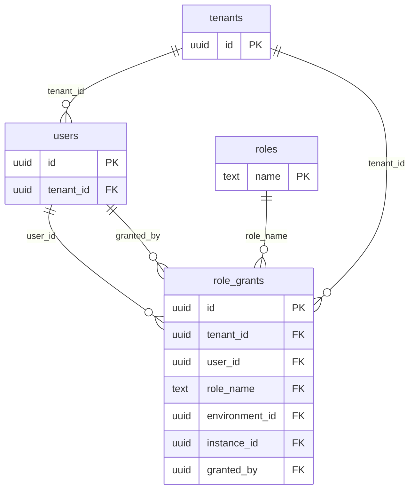
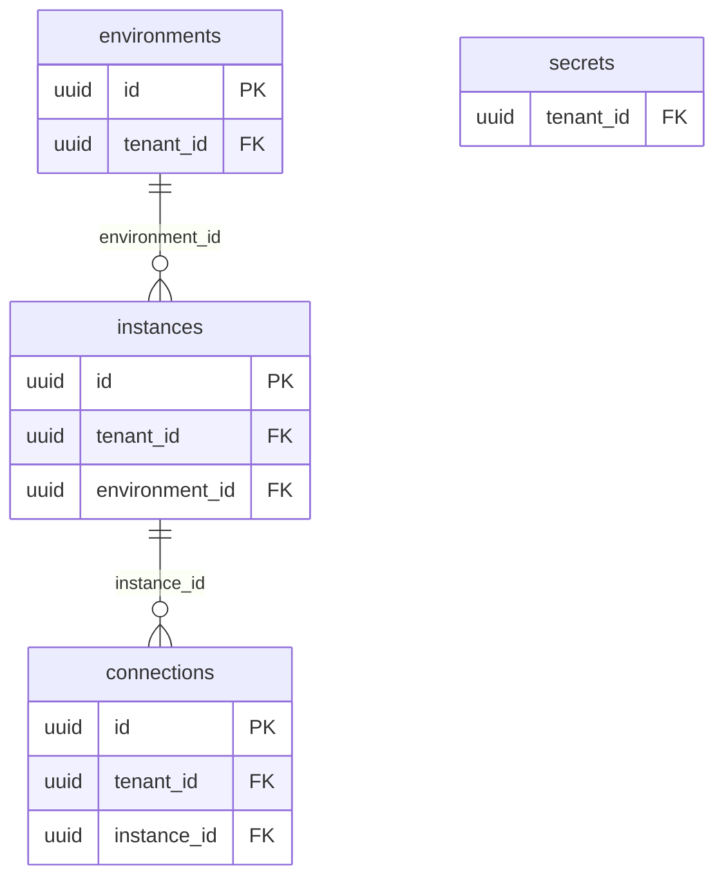
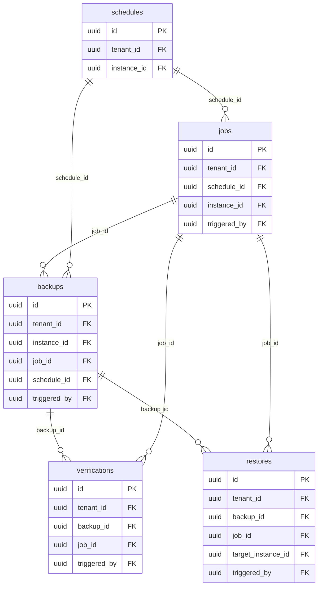
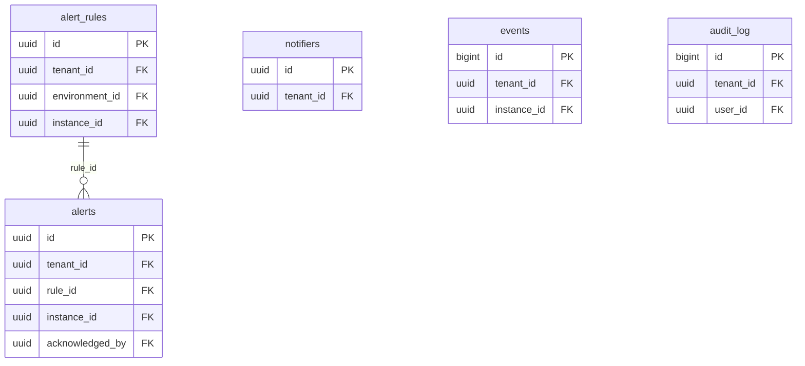

<!-- Generated by tools/docsgen. DO NOT EDIT. -->
<!-- Source: internal/storage/metadb/migrations/000001_init.up.sql, internal/storage/metadb/migrations/000002_observed_backups.up.sql — change that, then run `make docs`. -->

# Data model

18 tables, grouped by the question they answer. The schema is deliberately ahead of the code: the
scheduler, alerting, and RBAC tables are complete and unused, because a column added later costs a
migration and an audit of every query, while a column carried unused costs nothing.

Drawn in four diagrams rather than one. All 18 tables in a single entity diagram is a picture nobody
reads.

## Identity and tenancy

Every tenant-scoped table carries `tenant_id` from the first migration. Retrofitting tenancy would mean a full-schema migration plus an audit of every query, so the column is carried unused rather than added later ([ADR-0008](../adr/0008-oidc-rbac-multitenancy.md)).

## Inventory

What is being watched, and how to reach it. Credentials are split: everything non-secret is on `connections`, while the password and any client private key go to the secrets provider under a name that row carries.

## Operations

Scheduled work and its results. `jobs` carries the lease columns an at-most-once scheduler needs — `lease_owner`, `lease_expires_at`, `heartbeat_at` — which nothing writes yet.

## Observability

Facts, conditions, and the record of who did what. `events` are facts; `alerts` are conditions with a lifecycle. `audit_log` has a trigger that rejects UPDATE and DELETE, because an audit log that can be edited is not evidence.

## Every table

| Table           | Columns | Tenant-scoped | References |
| --------------- | ------- | ------------- | --- |
| `tenants`       | 6       |               |  |
| `users`         | 9       | yes           | tenants |
| `environments`  | 7       | yes           | tenants |
| `instances`     | 16      | yes           | tenants, environments |
| `secrets`       | 6       | yes           | tenants |
| `connections`   | 11      | yes           | tenants, instances |
| `roles`         | 3       |               |  |
| `role_grants`   | 8       | yes           | tenants, users, roles, environments, instances |
| `schedules`     | 18      | yes           | tenants, instances |
| `jobs`          | 19      | yes           | tenants, schedules, instances, users |
| `backups`       | 29      | yes           | tenants, instances, jobs, schedules, users |
| `verifications` | 15      | yes           | tenants, backups, jobs, users |
| `restores`      | 16      | yes           | tenants, backups, jobs, instances, users |
| `alert_rules`   | 14      | yes           | tenants, environments, instances |
| `alerts`        | 16      | yes           | tenants, alert_rules, instances, users |
| `notifiers`     | 10      | yes           | tenants |
| `events`        | 8       | yes           | tenants, instances |
| `audit_log`     | 13      | yes           | tenants, users |
