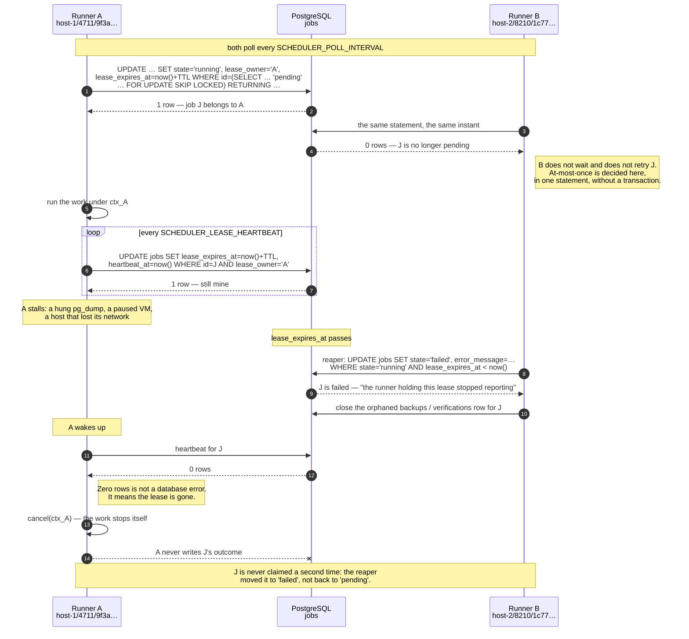

# Slice B1 — The scheduler and the job lease

## Goal

Make Fleetward run a backup, and its verification, without a human asking.

## Why now

Every backup and every verification in the tree today was triggered by a person typing a command.
That was enough to prove the loop works, which is what Phase A was for, and it is not enough to
install anywhere: a DBA with fifty servers does not want a button, they want the answer to have been
computed before they asked.

Two consequences follow, and B1 is the only slice that can deliver either.

- **Nothing runs on a schedule.** `schedules` exists, `config.SchedulerConfig` is parsed and
  cross-validated, and no line of Go reads either. There is nothing to install.
- **A backup killed by `kill -9` stays `running` forever.** The `jobs` table has `lease_owner`,
  `lease_expires_at`, `heartbeat_at`, and the covering index for the claim query. None of them has
  ever been written. This is the oldest debt in the tree, and it is not a cosmetic one: a row that
  says `running` for three weeks is a monitoring tool lying about the thing it exists to watch.

Both are entries in `STATUS.md`'s known-broken list, both name B1, and both close here.

## Preconditions

All of these already hold. They are listed so that a session started out of order notices.

- **Phase A is complete.** `backup.Service.RunBackup` and `RunVerification` work end to end,
  including the failure modes, and the conformance suite covers the path.
- **The schema is already there.** `schedules` and `jobs` were created by `000001_init.up.sql`, with
  the lease columns, `idx_jobs_claimable`, and `idx_jobs_one_active_per_instance_kind`.
  **This slice adds no migration.**
- **`metadb.IsUniqueViolation` exists** and already names the partial unique index as its reason for
  existing.
- **`job_id` is already one of the four correlation identifiers** promoted from `context` onto every
  log record by `internal/telemetry/logging.go`.
- **`api.Health.Register` already takes a non-critical checker**, so the scheduler can degrade
  readiness without failing it.

## Design decisions already made

These were settled during planning. They are written down so that they are not relitigated, which is
this project's expensive failure mode.

### 1. ADR-0013 stands

Internal cron, leases in PostgreSQL, at-most-once. No queue, no Kubernetes CronJob, no in-memory
timer. Nothing here reopens that record.

`robfig/cron/v3` enters `go.mod`, and it is used **only as an expression parser** —
`cron.ParseStandard(expr).Next(t)`. Its own in-process runner is never started. That distinction is
the next decision.

### 2. The clock is `schedules.next_run_at` in the database, never an in-process timer

A `time.Ticker` holding "the next backup is at 02:00" has two defects that no amount of care fixes:
it does not survive a restart, and two replicas each hold their own copy and both fire.

So the tick loop asks the database what is due. The loop itself is a dumb poll on
`SCHEDULER_POLL_INTERVAL` (10s by default); every decision that matters is a row.

> **For the product:** if the control plane restarts at 01:59, the 02:00 backup still runs. If it is
> down from 01:55 to 02:05, the backup runs at 02:05 — late, and visible as late, rather than
> silently skipped.

### 3. Claiming a job is one `UPDATE ... RETURNING`

Not `SELECT ... FOR UPDATE SKIP LOCKED` followed by a separate `UPDATE`. One statement is atomic
without a transaction, and it cannot leave a job claimed in the database but unrecorded in the
process — which is the gap the two-statement version opens.

```sql
UPDATE jobs
SET    state            = 'running',
       lease_owner      = $1,
       lease_expires_at = now() + $2::interval,
       heartbeat_at     = now(),
       attempts         = attempts + 1,
       started_at       = COALESCE(started_at, now()),
       updated_at       = now()
WHERE  id = (
    SELECT id FROM jobs
    WHERE  state = 'pending'
      AND  scheduled_for <= now()
    ORDER  BY scheduled_for
    LIMIT  1
    FOR UPDATE SKIP LOCKED
)
RETURNING id, tenant_id, instance_id, kind, payload, schedule_id;
```

The subselect is there because PostgreSQL's `UPDATE` has no `LIMIT`; `SKIP LOCKED` is there so two
runners pick different rows instead of queueing behind one. It is still a single statement, and that
is the property being bought.

### 4. `lease_owner` is `<hostname>/<pid>/<process-uuid>`

The UUID is the part that earns its place. A control plane restarted on the same host can be handed
a recycled pid, and `host-1/4711` would then look like the same owner as the process that died —
which would let a new process renew a lease it never claimed. The UUID is generated once at startup
and makes every process distinguishable from every other, including its own predecessor.

### 5. An expired lease fails its job; the job does not become claimable again

The comment on the `jobs` table says an expired lease makes a job "claimable again". Designing it
that way turned out to be wrong, and this slice changes it — recorded as **ADR-0025**, with a
reciprocal correction note so the relationship is visible from both ends.

The reasoning: the realistic cause of an expired lease is a control plane killed mid-backup. Its
multipart upload was never completed, so no artifact exists; its `backups` row says `running` and
describes nothing. Re-running automatically would mean a six-hour `pg_dump` starting itself against
a production server at the exact moment that server came back up — the single most expensive thing
this product could do unasked.

So a **reaper** marks such a job `failed`, with a message that says what happened, and closes the
orphaned `backups` or `verifications` row alongside it. The next scheduled tick creates a new job in
the ordinary way. A missed backup is recoverable and visible; an unexpected one is an incident.

This also buys the strongest form of at-most-once: a job row moves `pending -> running` exactly
once, ever, so no job is executed twice by any path.

> **For the product:** after a crash you see a failed backup, with a reason, at the time it actually
> failed — not a row frozen at `running`, and not a surprise dump at 09:00 on Monday.

### 6. Verification is enqueued as a separate `jobs` row of kind `verify`

Not chained in-process. When a scheduled backup succeeds, the runner consults the verification
policy carried in the job's payload and, if it fires, inserts a `pending` job of kind `verify` whose
payload names the backup.

Two reasons, both about being able to answer questions later:

- `verify_policy` and `verify_sample_percent` become **visible decisions in the job table**. "Why
  was this backup never verified" is answerable by looking, rather than by reading the scheduler's
  source.
- The verification then competes for the same `SCHEDULER_MAX_CONCURRENT_JOBS` budget as everything
  else, which is what finally bounds concurrent verifications. Each one holds a container and a
  spooled artifact; fifty of them starting at 02:00 is a resource incident.

The existing in-process chaining stays exactly as it is for the **manual** path
(`RunBackupInput.VerifyOnCompletion`), because a human who asked for both wants both.

### 7. A run's parameters are snapshotted into the job when the job is created

The backup job's `payload` carries the method, options, databases, and verification policy copied
from the schedule at the moment the job was created. The runner never re-reads the schedule.

A schedule edited at 02:15 must not change what the 02:00 run was asked to do. The job row is the
record of what was actually asked.

### 8. No migration

`schedules` and `jobs` are already exactly right. A slice that added a migration here would be a
slice that had misread the schema.

### The lease protocol

Two runners — two replicas, or the same binary restarted — against one `jobs` table. This is the
design, drawn before the code.



## Files

**New**

- `internal/controlplane/scheduler/scheduler.go` — the component: construction, the tick loop, the
  concurrency budget, `HealthCheck`, `Close`.
- `internal/controlplane/scheduler/lease.go` — owner identity and every lease statement: claim,
  heartbeat, release, reap.
- `internal/controlplane/scheduler/cron.go` — expression parsing and `next_run_at` computed in the
  schedule's own location.
- `internal/controlplane/scheduler/runner.go` — one job from claim to recorded outcome, including
  enqueueing the `verify` job.
- `internal/controlplane/scheduler/service.go` — schedule CRUD behind `ScheduleService`, and the job
  listing.
- `internal/controlplane/scheduler/grpc.go` — the gateway-facing server, following
  `inventory/grpc.go` and `backup/grpc.go`.
- `internal/controlplane/scheduler/{cron,scheduler}_test.go` — unit tests.
- `internal/controlplane/scheduler/integration_test.go` — `//go:build integration`, testcontainers.
- `cmd/fleetward-cli/schedule.go` — `fleetward-cli schedule create|list|delete|enable|disable` and
  `fleetward-cli job list`.
- `docs/adr/0025-an-expired-lease-fails-its-job.md`.
- `docs/dev/journal/B1-scheduler-and-leases.md`.

**Modified**

- `api/proto/fleetward/v1/controlplane.proto` — `ScheduleService`, plus `Schedule` and `Job`
  messages. Additive; `buf breaking` must stay green. Regenerate `api/gen/` and `api/openapi/`.
- `internal/controlplane/backup/service.go` — `execute` takes its parent context as a parameter and
  returns an error; `createRows` accepts a job that already exists, and sets `backups.schedule_id`.
- `internal/controlplane/backup/verify.go` — the same two changes for `verify` and
  `createVerificationRows`.
- `cmd/fleetward/main.go` — build and start the scheduler **after** the backup service, register its
  health checker, and `import _ "time/tzdata"`.
- `tools/docsgen/config.go` — the `SCHEDULER_` note currently reads "read by nothing"; it no longer
  is. Then `make docs`.
- `README.md` — the layout tree gains `scheduler`, the sentence promising it in B1 goes away, and
  the "no scheduler, so nothing runs automatically" line in the status paragraph changes.
- `CLAUDE.md` §3 — `controlplane/{api,inventory,backup,sandbox}/` becomes
  `controlplane/{api,inventory,backup,sandbox,scheduler}/`. **`make docs-check` fails until this is
  done**, by design.
- `docs/architecture.md` — the scheduler box stops being dashed, and the sentence under the diagram
  listing it as planned changes.
- `docs/dev/STATUS.md` — rewritten.
- `docs/dev/slices/README.md` — the slice table.
- `go.mod` / `go.sum` — `github.com/robfig/cron/v3`.

## Reuse, do not rewrite

The scheduler is a small component on top of machinery that already exists. Everything below is
built, tested, and must not be reimplemented.

| Already there | Where | What it means for this slice |
|---|---|---|
| `RunBackup` / `RunVerification` are asynchronous, with a `WaitGroup` and a **detached recording context** | `backup/service.go`, `backup/verify.go` | The hard part — an outcome recorded even when the run is cancelled — is solved. Do not write a second copy. |
| Both are already parameterised on `TriggeredManually` and `VerifyOnCompletion` | `backup.RunBackupInput` | The scheduled path is the same call with different arguments, not a different code path. |
| The unique index is already treated as a concurrency constraint | `metadb.IsUniqueViolation` | Use it. Do not add a `SELECT` that checks first — that is the race the index exists to close. |
| `api.Health.Register(name, critical, checker)` accepts non-critical checkers | `controlplane/api/health.go` | Register `"scheduler"` as non-critical: a stalled scheduler should degrade readiness, not take the estate view offline. |
| `job_id` is promoted from context onto every log line | `telemetry/logging.go` | Wrap the runner's context with `telemetry.WithJobID`; do not add `slog.String("job_id", …)` by hand. |
| `sandbox.Provider`, teardown guaranteed on every path | `controlplane/sandbox` | Verification already cleans up after itself. The scheduler adds a concurrency bound and nothing else. |
| Sentinel errors mapped to status codes in exactly one place | `backup/grpc.go`, `inventory/grpc.go` | Follow the same shape for `ScheduleService`. |

The one genuine change inside `backup` is that `execute` and `verify` currently derive their context
from `s.runCtx` and return nothing. The scheduler needs the work bound to **its** runner context — a
lost lease must be able to stop the work — and needs to know whether the backup succeeded, in order
to decide about verification. So both take a parent context and return an error. `RunBackup` passes
`s.runCtx` and discards the error exactly as today; the manual path's behaviour is unchanged.

## Traps

Six things that will bite.

### `idx_jobs_one_active_per_instance_kind` raises `23505`, and that is correct

It is a **partial unique index**, not a check the code performs. Inserting a second `pending` backup
job for an instance that already has one raises SQLSTATE `23505` rather than inserting a row.

The scheduler must read that as **"already scheduled — skip this tick"**, log it at warn level with
the instance and the schedule, and move on. It is not an error to report to anyone and it is
certainly not a reason to stop the loop. In production it means something real and worth seeing:
*your backup is taking longer than the interval you scheduled it at.*

`jackc/pgerrcode` is already an indirect dependency and `metadb.IsUniqueViolation` already wraps the
check. Neither needs adding.

### A lease that expires while its goroutine is still running

The subtle one. The heartbeat statement ends `WHERE id = $1 AND lease_owner = $2`. When it reports
**zero rows affected**, that is not a database error and must not be logged as one — it means the
lease is gone, someone else has written this job's outcome, and this runner is now a ghost holding
a connection to a production server.

The runner must cancel its own context and stop, and must not write the job's outcome afterwards.

This needs a test, and the test is the point of the trap: claim a job, let the lease expire without
heartbeating, run the reaper, then assert that the next heartbeat returns zero rows, that the
runner's context is cancelled, and that the job's terminal state is the reaper's rather than the
runner's.

Note precisely what this guarantee is and is not. Because the reaper moves the job to `failed`
rather than back to `pending`, **no job is ever claimed twice** — that is closed by decision 5, in
the database. Cancelling on a lost lease is what stops the orphaned work: a `pg_dump` nobody is
waiting for, a sandbox nobody will tear down, a connection nobody will close.

### `schedules.timezone` exists, and DST is real

Compute the next fire time **in the schedule's own location**, then store UTC:

```go
loc, err := time.LoadLocation(s.Timezone)   // "Europe/Bucharest"
next := spec.Next(now.In(loc)).UTC()        // stored as UTC, always
```

A DBA writing `0 2 * * *` for a Bucharest server means 02:00 Bucharest, which is 00:00 UTC in winter
and 23:00 UTC the previous day in summer. Computing in UTC would drift the backup window by an hour
twice a year, into and out of the business day.

Then **document what a transition actually does**, rather than pretending it does not happen. Write
a table-driven test over a real DST-observing zone across both transitions, pin the observed
behaviour in the test, and carry the finding into the journal entry and the schedule documentation.
An hour that does not exist on the spring-forward day, and an hour that occurs twice on the
fall-back day, both have an answer; the requirement is that the answer is known and written down,
not that it is any particular answer.

> **For the product:** twice a year one scheduled backup on a machine in a DST zone lands at an hour
> a DBA might not expect. That deserves a sentence in the documentation and a test. It does not
> deserve a policy engine.

### `time.LoadLocation` has no time-zone database inside the container

Invisible until deployment. Go does not embed the tz database; `time.LoadLocation` reads it from the
operating system, and `debian:trixie-slim` — the runtime stage of `deploy/docker/Dockerfile` — does
not ship `tzdata`. Every schedule with a real timezone would fail to load inside the image while
working perfectly on a development machine, because a Go *installation* carries
`$GOROOT/lib/time/zoneinfo.zip` and a Go *binary* does not.

Fix it with `import _ "time/tzdata"` in `cmd/fleetward/main.go`. It embeds the database in the
binary for roughly 450 KB, works everywhere including a future distroless image, and cannot drift
from the container's package set. Installing the `tzdata` package instead would fix this image and
quietly break the next one.

### Shutdown ordering

`main.go` registers `defer backupSvc.Close()`, which cancels every running backup and **waits** for
each to record its outcome. Deferred calls run in reverse order of registration, so the scheduler
must be constructed and its `Close` deferred **after** the backup service.

That gives the only correct sequence: the scheduler stops claiming and drains its runners, and then
the backup service drains. In the other order the backup service waits for runs the scheduler is
still starting, and shutdown never completes.

Write the reason as a comment beside the `defer`, the way the existing one is commented. A future
session reordering three lines for tidiness is exactly how this breaks.

### The tick loop must never die

A poll loop that returns on its first error stops the entire product silently: no log line says "the
scheduler exited", backups simply stop happening, and nobody finds out until a restore is needed.
Every error inside one tick — a database blip, a malformed cron expression, a `23505` — is logged
and the loop continues. The only thing that ends it is context cancellation.

Register the scheduler with `health.Register("scheduler", false, …)` and have its `HealthCheck`
report the age of the last completed tick. That is what turns "the scheduler stopped" from a silent
failure into a degraded readiness probe.

## Scope fence

Explicitly **not** in this slice. Each is somewhere else on the roadmap, and a half-finished B1 is
worse than a small complete one.

- **Retries and backoff.** `jobs.max_attempts` exists and is left alone. A failed job is failed; the
  next scheduled tick creates a new one. Retry policy is a design question of its own and is not on
  the path to running unattended. **B5 or later.**
- **Schedules of kind `discovery` or `metrics`.** `schedules.kind` permits both; B1 materializes
  only `backup`, plus the `verify` jobs it enqueues. Creating a schedule of another kind is refused
  with a clear message. Scheduled health probes belong with the estate view. **B4.**
- **Retention and expiry.** The scheduler makes artifacts accumulate faster; it does not delete
  them. `schedules.retention_days` stays stored and unread. **B5.**
- **Authorization.** Every new route is open, exactly like every existing one. No RBAC check, no
  audit row. **B6.**
- **Alerting on a missed window or a failed verification.** The scheduler makes both detectable and
  delivers neither. **B7.**
- **Scheduler metrics and spans.** Log lines only. **B8.**
- **A UI for schedules.** CLI and REST only. **B4.**
- **A global cap on manually triggered verifications.** `SCHEDULER_MAX_CONCURRENT_JOBS` bounds
  scheduled work, which is the case `STATUS.md` describes. A human triggering fifty verifications by
  hand is still unbounded, and `STATUS.md` must say so rather than claiming the debt fully closed.
- **Multi-replica deployment.** The lease protocol is designed for it and the tests prove two
  runners contend correctly. Actually shipping a replicated control plane needs a deployment
  artifact that does not exist yet. **B9.**

## Done when

Every command below runs and produces what it says.

```bash
make lint
make test                 # includes the lease and DST unit tests
make test-integration     # includes the two-runner contention test
make conformance          # unchanged, still green
make docs-check           # passes only once README.md and CLAUDE.md name the new package
make docs && git diff --exit-code docs/     # docsgen output is committed
buf breaking --against '.git#branch=main'   # ScheduleService is additive
```

The demonstration, end to end, against `make dev`:

```bash
# a schedule that fires every minute, in a real timezone
fleetward-cli schedule create --instance prod-1 \
    --cron "* * * * *" --timezone Europe/Bucharest --verify always
fleetward-cli schedule list          # next_run_at is set, in UTC, one minute out

# wait, then look at what ran without anyone asking
fleetward-cli job list --instance prod-1
#   backup   succeeded   schedule=<id>
#   verify   succeeded   schedule=<id>
fleetward-cli backup list --instance prod-1   # backup ✓ / verified ✓
```

Crash recovery, which is the half of this slice that has no screen:

```bash
# let a scheduled backup start, then kill the control plane mid-run
docker compose kill -s SIGKILL fleetward
docker compose up -d fleetward

# within one lease TTL the reaper has closed the orphan
fleetward-cli job list --instance prod-1
#   backup   failed   "the runner holding this job's lease stopped reporting"
# and the backups row says failed too — not running, not missing
```

Two runners, which is what the lease is actually for:

```bash
docker compose up -d --scale fleetward=2
# every job appears exactly once in `job list`; neither process logs a lease error
```

And the negative case, because a scheduler only ever observed to fire is indistinguishable from one
that fires twice:

```bash
fleetward-cli schedule disable --schedule <id>
# next_run_at stops advancing; no new jobs appear; running ones finish normally
```

**Close out** per [`README.md`](README.md): journal entry; `STATUS.md` rewritten with the three B1
entries removed from the known-broken list and the manual-verification cap named as still open;
`README.md` and `docs/architecture.md` updated because the scheduler stops being a dashed box;
ADR-0025 written with its reciprocal note; the slice table in this directory's `README.md` marked
done.
