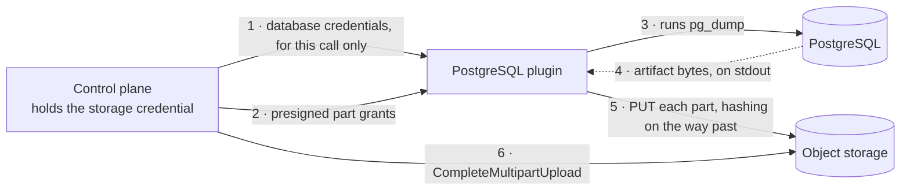
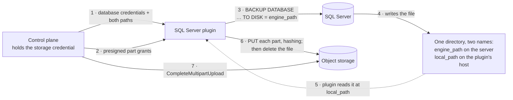
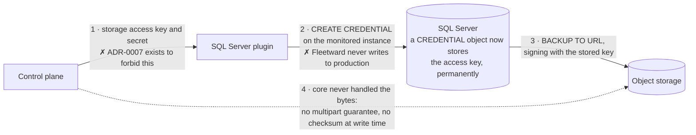
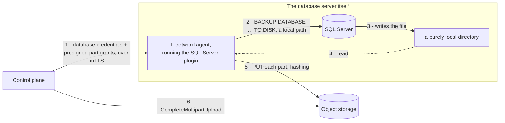

# Slice B2 — The SQL Server plugin, and the first real test of the contract

## Goal

Make SQL Server pass the shared conformance suite **unmodified**, and find out what that costs the
contract.

## Why now

The claim that adding an engine never means modifying core appears in `CLAUDE.md` §1 and §4, in
`README.md`, in [ADR-0003](../../adr/0003-hashicorp-go-plugin.md), and in the design of the whole
conformance suite. It has never been tested. One engine cannot test it: PostgreSQL is the engine the
contract was written against, so of course it fits.

**SQL Server is not the deliverable — the test of that claim is.** This slice is the first real
exercise of acceptance criterion `CLAUDE.md` §7.8, that a developer can bring a new engine through
conformance without touching core, and the first exercise of the whole of Stage 1 by an engine the
suite was not written for.

It is also the cheapest this will ever be. `buf breaking` is enforced, but there is no tag, no
published image, and no third-party plugin, so a contract change today costs a regenerate. After
`v0.1.0` publishes the contract as a public interface, the same change costs a deprecation cycle.

SQL Server rather than the easier MySQL because it asks the contract a question PostgreSQL never
did, and the answer binds three engines rather than one — see
[the open decision](#the-open-decision--how-the-artifact-gets-out-of-sql-server). The reasoning is
recorded in [`../../roadmap.md`](../../roadmap.md) and is not reopened here.

> **For the product:** after this slice, a DBA can point Fleetward at a SQL Server instance and get
> the same two-part answer they already get for PostgreSQL — the backup ran, and the backup was
> restored into a throwaway container and checked. Nothing else in Fleetward changes, and that is
> the whole point.

## Preconditions

All of these already hold. They are listed so that a session started out of order notices.

- **Phase A is complete and B1 shipped.** `backup.Service`, `sandbox.Provider`,
  `objstore.ObjectStore`, and the scheduler all work end to end against PostgreSQL.
- **The conformance suite already covers the whole path**, including four negative cases, and it is
  capability-gated: a plugin opts into Stage 1 by declaring a backup method,
  `supports_sandbox_restore`, a `SandboxTemplate`, and a registered fixture
  ([ADR-0023](../../adr/0023-conformance-fixtures-seed-what-the-contract-cannot.md)).
- **`sdk.Base` supplies a typed refusal for every RPC**, so the plugin satisfies the contract at
  every point in its construction rather than only at the end.
- **`internal/plugin/manager` derives the engine type from the binary filename** and refuses a
  mismatch at handshake, so the binary must be named `fleetward-plugin-sqlserver`.
- **No migration is needed.** `backups`, `verifications`, `jobs`, and `schedules` carry no engine
  column that would have to learn a new value.

## Design decisions already made

Settled before this brief was written. They are recorded so they are not relitigated, which is this
project's expensive failure mode.

### 1. The conformance suite does not change

Not one assertion, not one helper, not one skip condition. The only file this slice adds under
`test/conformance/` is a fixture, plus the single line in `fixtures_test.go` that registers it. If
anything else in that directory has to move, that is the contract leak this slice exists to find,
and the finding **is** the result — stop and say so rather than editing the test.

### 2. The engine type is `sqlserver`

Lowercase, no punctuation, the same shape as `postgresql`. It fixes the binary name
(`fleetward-plugin-sqlserver`), the two source directories, and the fixture key.

### 3. Backup and restore are T-SQL, so this plugin orchestrates no external binary

`BACKUP DATABASE` and `RESTORE DATABASE` are statements, not command-line tools. `required_tools`
is therefore empty, and `sqlcmd` is never shelled out to.

Two consequences, both pleasant. The plugin has no `PATH` dependency, so it cannot fail at 3am
because a host is missing a client package. And `requireVerifiablePlugin` skips a plugin whose
declared tools are missing — with none declared, **the Stage 1 cases actually run on this Windows
development machine**, which is not true of PostgreSQL here.

It also removes a whole class of ADR-0022 confusion: there is no tool exit code to misread, so
`ERROR_CODE_TOOL_FAILED` never appears on this plugin's restore path.

### 4. One backup method, and it is a native full database backup

`BACKUP DATABASE … WITH CHECKSUM, COMPRESSION, FORMAT, INIT`, one database per artifact.
`BACKUP_KIND_PHYSICAL`, `is_default = true`, `enables_pitr = false`, `requires_downtime = false`.

`WITH CHECKSUM` is not decoration: it makes SQL Server validate page checksums as it writes, and
lets `RESTORE` refuse a damaged backup set on its own. That is a second, independent detector
alongside the SHA-256 core records.

### 5. `RECORD_COUNTS` is effectively mandatory, not optional

`TestVerificationFailsWhenTheSourceNoLongerMatchesItsManifest` requires a `Discrepancy` naming the
object with both counts. A plugin that enters Stage 1 without per-object counts cannot pass it. So
the manifest is per-table `COUNT(*)` over `sys.tables`, and this is not a place to economise.

### 6. Verification checks that are declared are checks that run

The suite fails a plugin that declares a check and does not run it. This slice declares exactly
five: `CONNECTIVITY`, `SCHEMA_PRESENCE`, `RECORD_COUNTS`, `INTEGRITY` (`DBCC CHECKDB WITH
PHYSICAL_ONLY`), and `QUERYABILITY`.

### 7. ADR-0022's classification is copied in spirit, not in code

The artifact is written down and hashed **in full before a single statement runs against the
target**, exactly as the PostgreSQL plugin spools and hashes before `pg_restore`. A target that does
not answer is `sdk.ConnectionFailed`, established before the restore is attempted, and never
anything else.

---

## The open decision — how the artifact gets out of SQL Server

**This is the decision the slice exists to make, and it is not mine to make silently.** It needs its
own ADR either way, and whatever is chosen here is chosen for Oracle's RMAN and Cassandra's
`nodetool snapshot` as well, because all three write a file on the database server rather than to a
stream.

### The baseline: how PostgreSQL does it today



The plugin never touches a storage credential and never touches a file. The artifact becomes a
visible object only when core completes the upload
([ADR-0021](../../adr/0021-plugins-upload-artifacts-as-multipart-parts.md)).

`BACKUP DATABASE … TO DISK` breaks step 4. There is no stdout. The bytes land on the **database
server's** filesystem, where the plugin has no access at all.

### Option A — a directory both sides can see



**Which credential travels where.** Database credentials reach the plugin for one call, as today.
The storage credential never leaves core, as today. Nothing at all reaches SQL Server.

**What it costs.** An operational precondition — a directory the DBA configures once per instance,
which in a SQL Server shop usually already exists, because that is where their existing backups go.
And four additive contract fields, listed in
[the next section](#what-the-contract-turns-out-to-be-missing).

**What it does not cost.** Nothing about the upload path changes. Steps 5 to 7 are byte for byte the
PostgreSQL path; only the source of the stream differs, a file instead of a pipe.

### Option B — `BACKUP TO URL` against the object store



SQL Server 2022 speaks S3 natively, and this is the option that would need the least code. It fails
on three counts, not one.

1. **A static storage credential reaches the engine.** `BACKUP TO URL` authenticates through a
   `CREDENTIAL` object holding an access key and secret; it cannot consume a presigned URL. The
   plugin — the least trusted component in the system, and the one third parties will write — has to
   handle that key in order to install it. That is exactly the trade
   [ADR-0007](../../adr/0007-s3-object-storage-for-artifacts.md) refused.
2. **Fleetward would write a server-level security object to a production instance.** Every other
   part of this product is read-only against monitored databases on purpose
   ([ADR-0017](../../adr/0017-access-compliance-read-only.md),
   [ADR-0018](../../adr/0018-query-editor-on-the-roadmap.md)). `CREATE CREDENTIAL` is not a small
   exception to that rule; it is access control.
3. **The artifact's evidence chain breaks.** The engine writes the object directly, so there is no
   multipart upload for core to complete — which means a half-written backup *is* a visible object,
   the exact failure ADR-0021 was written to make impossible — and the checksum is computed after
   the fact rather than as the bytes are written.

A variant is worth naming: **the DBA pre-creates the `CREDENTIAL` themselves** and Fleetward merely
names it. That removes objection 2 and softens objection 1, since Fleetward would never see the
secret. Objection 3 stands unchanged, and the artifact would land in a bucket whose keys, retention,
and lifecycle Fleetward does not own. It is a reasonable future option for large or air-gapped
estates. It is not a foundation.

### Option C — co-locate the plugin with the database server



Correct, and eventually necessary — `CLAUDE.md` §2 already names an agent among the things written
in Go. It is also a phase rather than a slice: an agent binary, its transport, its supervision, its
mTLS, its deployment story, and its upgrade story, none of which exist.

**And it is the same shape as Option A.** Option C is Option A with `engine_path == local_path`.
Choosing A today does not close C off; it builds the field C will fill in.

### Recommendation

**Option A.** It is the only one of the three that preserves every existing guarantee — no
credential reaches the engine, no write reaches production, the multipart guarantee and the
write-time checksum are untouched — and it is a strict subset of Option C, so it is not a detour.

It is also honest about where the difficulty actually is. The difficulty is not the code; it is that
somebody has to configure a directory. That is a precondition Fleetward can check and explain, which
is a far better failure than a credential nobody can revoke.

> **For the product:** Fleetward asks a SQL Server DBA for one extra thing when they add an instance
> — "where does this server write its backup files, and how do I reach that same directory?" — and
> in exchange asks for nothing else at all: no key, no grant, no change to the server. If they
> cannot answer, Fleetward refuses to create the schedule and says why, instead of failing at 3am.

**No code is written against this decision until it is approved, and the ADR is written first.**

---

## What the contract turns out to be missing

Found by standing the real image up rather than by reading its documentation. Every one of these is
**additive**, so `buf breaking` passes, and none of them puts an engine's name in core.

### 1. `SandboxTemplate` cannot say the image enforces a password policy

Measured, against `mcr.microsoft.com/mssql/server:2022-latest`:

```
ERROR: Unable to set system administrator password: Password validation failed. The password does
not meet SQL Server password policy requirements because it is not complex enough. The password
must be at least 8 characters long and contain characters from three of the following four sets:
Uppercase letters, Lowercase letters, Base 10 digits, and Symbols.
```

The container exits 255 and never becomes ready. Core generates 24 random bytes rendered as
base64url ([ADR-0020](../../adr/0020-sandbox-credentials-from-template-placeholders.md)), an
alphabet of 26 uppercase, 26 lowercase, 10 digits, and 2 symbols. Failure needs two classes absent
at once, and over 32 characters that is `(52/64)^32` ≈ **0.13 %, about one sandbox in eight
hundred.**

That is the worst possible defect shape: a verification that fails for no reason a few times a year,
on a machine nobody is watching. Proposed:

```proto
message PasswordPolicy {
  int32 min_length = 1;
  // Minimum number of distinct classes — upper, lower, digit, symbol — the password must contain.
  int32 min_character_classes = 2;
  // Symbols this engine accepts. Empty keeps core's default alphabet.
  string symbol_alphabet = 3;
}
```

on `SandboxTemplate`, honoured by construction rather than by rejection sampling: take one character
from each required class, fill the rest randomly, shuffle. An empty policy leaves today's behaviour
exactly as it is, so PostgreSQL is untouched.

### 2. `SandboxTemplate` cannot say the image's administrative account is fixed

The good news, and it was not expected: `mcr.microsoft.com/mssql/server` supports `MSSQL_USER`,
`MSSQL_PASSWORD`, and `MSSQL_DB`, the direct equivalents of `POSTGRES_USER` and its siblings, so
ADR-0020's placeholders work unchanged. Verified: ready in about nine seconds warm, with the
database created and the login working.

The bad news is what that login can do. Measured:

```
SELECT SUSER_NAME(), IS_SRVROLEMEMBER('sysadmin'), IS_SRVROLEMEMBER('dbcreator')
  →      fleetward     0                            0
```

The image grants the created login `CONTROL` on its database and nothing at the server level, and
SQL Server documents explicitly that `db_owner` does **not** carry `RESTORE` permission — only
`sysadmin`, `dbcreator`, or the database's actual owner. So the sandbox account core generates
cannot restore into the sandbox, which is the one thing the sandbox exists for.

The fix that keeps an engine name out of core:

```proto
// Account this image always creates and cannot be told to rename, e.g. "sa". Empty means core
// generates a username, exactly as it does today.
string fixed_username = 11;
```

Core then renders `{{ .Username }}` to `sa`, still generates the password, and everything
downstream — the readiness probe, the credentials handed to the plugin, the fixture's own
connection — follows without knowing why. A sandbox lives for minutes on loopback behind a fresh
random password, so `sa` there is the same trust boundary PostgreSQL already has: its `fleetward`
user *is* the cluster superuser.

### 3. Nothing can express "this engine writes its artifact to a filesystem"

Needed only under Option A, and needed in both directions — `BACKUP … TO DISK` writes a file the
plugin must read, and `RESTORE … FROM DISK` reads a file the plugin must write.

```proto
// common.proto
message SharedDirectory {
  // The path as the engine sees it. Used verbatim in statements sent to the engine.
  string engine_path = 1;
  // The same directory as the process running the plugin sees it. Often a different mount point.
  string local_path = 2;
}

// on Credentials, which is already everything core resolved about reaching this instance:
SharedDirectory shared_directory = 8;

// plugin.proto, on SandboxTemplate — the path inside the container at which core mounts a
// directory the plugin can also read and write:
string shared_directory = 10;

// plugin.proto, on BackupMethod — so core can refuse to schedule, and the UI can say what is
// missing, without knowing which engine it is talking about:
bool requires_shared_directory = 13;
```

Alternative placement considered: separate fields on `BackupRequest` and `RestoreTarget` rather than
one on `Credentials`. More precise, duplicated in two places, and every call that needs the
directory already carries `Credentials`.

### 4. A manifest cannot say a count could not be pinned to the artifact

`pg_dump` counts inside the very snapshot it exports, so a PostgreSQL manifest is exact by
construction — `plugins/postgres/manifest.go` says so, and says why it matters. SQL Server's
`BACKUP DATABASE` is consistent at its own ending LSN, and a `COUNT(*)` on a live database cannot be
tied to that LSN without either snapshot isolation or a database snapshot, and **both of those are
writes to a monitored instance**.

On a quiescent database — a nightly window, and every case the conformance suite runs — the counts
are exact and `FAILED` fires correctly. On a database being written to during its own backup, an
exact comparison would report data loss that did not happen, which is the single worst thing this
product can do.

Smallest honest fix:

```proto
// on ManifestEntry — the count could not be pinned to the artifact's consistency point, so a
// mismatch here is drift rather than data loss.
bool count_may_have_drifted = 6;
```

The plugin brackets the backup and the counting pass with `sys.dm_db_partition_stats.row_count`,
which is maintained metadata and free to read. Unchanged means exact. Changed means the flag is set
for that object, and a mismatch on a flagged entry becomes a discrepancy that yields `INCONCLUSIVE`
rather than `FAILED` — the same asymmetry ADR-0022 is built on. The polarity is deliberate: the
default `false` means "exact", so every existing PostgreSQL manifest keeps its current meaning.

If the slice runs long, this is the one of the four that can move to B3. The other three are
load-bearing for conformance passing at all.

---

## Files

### New

| Path | What |
|---|---|
| `plugins/sqlserver/plugin.go` | `EngineType`, `New`, `Capabilities` |
| `plugins/sqlserver/conn.go` | connection construction that never builds a string holding a password |
| `plugins/sqlserver/health.go` | `HealthCheck` — down is an answer, not an error |
| `plugins/sqlserver/discover.go` | version, databases, `sys.databases` |
| `plugins/sqlserver/backup.go` | the one method, the shared directory, the terminal message |
| `plugins/sqlserver/manifest.go` | `sys.tables` plus `COUNT(*)`, and the drift bracket |
| `plugins/sqlserver/restore.go` | download, hash, `RESTORE FILELISTONLY`, `RESTORE … WITH MOVE` |
| `plugins/sqlserver/verify.go` | the five declared checks |
| `cmd/plugins/sqlserver/main.go` | three lines, `sdk.Serve` |
| `test/conformance/` | one fixture file, and one line registering it |
| `docs/adr/` | the transport decision |
| `docs/dev/journal/` | the close-out entry |

### Modified

| Path | Why |
|---|---|
| `api/proto/fleetward/v1/common.proto` | `SharedDirectory`, `Credentials.shared_directory` |
| `api/proto/fleetward/v1/plugin.proto` | `PasswordPolicy`, `fixed_username`, `shared_directory`, `requires_shared_directory`, `count_may_have_drifted` |
| `api/gen/fleetward/v1/` | regenerated and committed — `make proto` |
| `internal/controlplane/sandbox/sandbox.go` | password generation honours a policy; identity honours a fixed username |
| `internal/controlplane/sandbox/docker.go` | mount the shared directory when a template declares one |
| `test/conformance/fixtures_test.go` | one line |
| `Makefile` | the `PLUGINS` list |
| `deploy/docker/Dockerfile` | one more `go build` line |
| `docker-compose.yml`, `.env.example` | a SQL Server service and the shared volume, for the walk |
| `.github/workflows/ci.yml` | conformance runtime and memory headroom |
| `docs/engines.md` | SQL Server's row, and the open question becomes an answer |
| `README.md`, `CLAUDE.md` | the layout trees name the two new directories |
| `docs/dev/STATUS.md` | rewritten |
| `docs/dev/writing-an-engine-plugin.md` | the new template fields |

> Core files appear in that list, and that is not a failure of the claim under test. The claim is
> that core needs no **engine-specific knowledge** — no name, no lookup table, no branch. Generic
> code consuming a new declarative field is the sanctioned fix, and the acceptance test for it is a
> `grep` that returns nothing.

## Reuse, do not rewrite

- **`plugins/postgres/upload.go`** — the multipart part-grant writer. It takes an `io.Reader`, so an
  open file works unchanged. Consider lifting it into `internal/plugin/sdk` rather than copying it:
  a second copy of the ADR-0021 protocol is a second place for it to drift.
- **`plugins/postgres/restore.go`** — the download-and-hash-before-touching-anything shape, the
  `sdk.ArtifactCorrupt` decision, and the reachability probe that runs before the restore.
- **`plugins/postgres/verify.go`** — check-by-check result assembly and `Discrepancy` reporting.
- **`plugins/postgres/conn.go`** — field-by-field connection construction, never a DSN.
- **`internal/plugin/sdk`** — every error constructor. Never return a bare error.
- **`test/conformance/fixture_postgresql_test.go`** — the shape and the size a fixture should be.
- **`internal/controlplane/sandbox/sandbox.go`** — placeholder rendering already exists and is
  tested; extend it, do not write a second one.

## Traps

Ordered by how much time each costs if it is found late. The first six were measured on this machine
against `mcr.microsoft.com/mssql/server:2022-latest` on 2026-09-02.

1. **A file SQL Server writes is `-rw-r----- 10001:10001`, and it ignores `umask`.** Verified: a
   command wrapper setting `umask 0022` changes nothing. On Linux CI the plugin runs as a different
   uid and **cannot read its own backup**. On Docker Desktop for Windows the mount layer hides this,
   so it will pass locally and fail in CI.
   **The fix, verified working: the plugin pre-creates the file, then backs up over it.** SQL Server
   opens an existing file rather than creating one, and the owner and mode survive:

   ```
   plugin : creates the file, empty, owned by the plugin
   T-SQL  : BACKUP DATABASE … TO DISK = N'…/id.bak' WITH FORMAT, INIT, CHECKSUM, COMPRESSION
   after  : -rwxrwxrwx … 512000 id.bak   ← still the plugin's file, now 500 KB of backup
   ```

   `WITH FORMAT, INIT` is what makes SQL Server accept a zero-byte file as its media set; without
   `FORMAT` it reads the existing header and refuses. **Settle this on Linux before writing the rest
   of the plugin** — it is the load-bearing assumption of Option A.
2. **Readiness is not "the port is open".** `MSSQL_DB` is created by a setup script that runs
   *after* the server starts, polling on a five-second loop. A probe of `SELECT 1` against `master`
   succeeds while the sandbox database still does not exist — observed directly. The readiness
   command must connect **to `{{ .Database }}`**:

   ```
   /opt/mssql-tools18/bin/sqlcmd -C -S 127.0.0.1,{{ .Port }} -U {{ .Username }} -P {{ .Password }} -d {{ .Database }} -Q "SELECT 1"
   ```

   `sqlcmd` and `bcp` are present at `/opt/mssql-tools18/bin` but not on `PATH`, so the absolute
   path is required. `-C` trusts the self-signed certificate the instance generates for itself.
3. **`ACCEPT_EULA=Y` and `MSSQL_PID=Developer` are both required** in `SandboxTemplate.env`, or the
   container exits before it starts.
4. **The restored file paths are not the source's file paths.** `RESTORE DATABASE` needs
   `WITH MOVE 'logical name' TO '…'` for every file in the backup set, and the logical names come
   from `RESTORE FILELISTONLY`, which has to run first. Verified end to end: two tables of 40 and
   120 rows restored across two containers through one shared directory.
5. **A damaged backup set has its own error numbers, and they are good ones.** Verified: a truncated
   artifact and a byte-flipped one both give `Msg 3203 … Read on "…" failed: 13(The data is
   invalid.)`, and a real restore of the flipped artifact gives `Msg 11801 … RESTORE detected one or
   more corrupted pages in the backup set`. Both map to `sdk.ArtifactCorrupt`. They are the second
   line of defence — per ADR-0022 the SHA-256 comparison happens first, before any statement runs.
6. **The image is smaller than feared and slower than PostgreSQL.** 625 MB, ready in about nine
   seconds warm. But a Stage 1 case stands up two instances and there are five cases, so budget
   roughly ten to twelve extra minutes on a cold CI runner including the pull. `make conformance`
   already allows sixty minutes, and the CI job sets no `timeout-minutes` of its own, so the risk is
   a slow run rather than a cut-off one. SQL Server needs 2 GB of RAM to start — check the runner's
   headroom with MinIO and PostgreSQL alongside it, and raise the timeout deliberately rather than
   leaving it at the six-hour default.
7. **A fifth plugin binary is not automatic.** The `PLUGINS` list in `Makefile` and
   `deploy/docker/Dockerfile`, which builds every plugin by name, both need the new engine — or the
   binary silently does not exist and every conformance case for it silently does not run.
8. **`make docs-check` will fail until the layout trees name the new directories.** `README.md` and
   `CLAUDE.md` §3 both carry one, and `tools/docscheck` asserts that every path the documentation
   names exists. That is deliberate, exactly as it was in B1, and fixing it is part of the slice.
9. **Run `go mod tidy` before pushing.** `github.com/microsoft/go-mssqldb` added with `go get` before
   it is imported stays marked `// indirect`, and building, testing, and linting are all happy with
   that. CI has a dedicated step that is not. This cost B1 a full CI cycle.
10. **`gofmt -l` and `buf format --diff` report every file in the tree on this machine.** It is a
    `core.autocrlf=true` artefact, not a finding. Verify in a worktree created with
    `git -c core.autocrlf=false worktree add`.
11. **`make` is not installed here.** Run the targets directly, and say so rather than reporting
    `make lint test` as passing.
12. **One pre-existing, unrelated failure.** `plugins/postgres`'s
    `TestDiscoverOnUnreachableInstanceFails` dials 192.0.2.1 expecting `CONNECTION_FAILED` and gets
    something pgx reads as `AUTHENTICATION_FAILED` on this network. Reproduced on `main` before B1.
    Not a regression; do not chase it.
13. **The docscheck allowances are temporary and self-reporting.** `docs/.docscheck-allow` carries
    nine entries so this brief may name files that do not exist yet. `tools/docscheck` reports an
    allowance nothing uses any more, so the moment each file is written its entry has to go — which
    is the mechanism working, not a new failure.
14. **`make conformance` passing locally means less than it looks.** Read the skip reasons, not the
    exit code. For this plugin there should be none — see decision 3 — which makes a skip here a
    finding rather than an expectation.

## Scope fence

Explicitly **not** in this slice. A session reading the roadmap will want to build all of it.

- **Point-in-time recovery, log backups, log shipping.** `supports_pitr` stays false, and
  `ListPITRTargets` answers with an unavailable window and a reason, which the suite checks.
- **Always On availability groups, failover cluster instances, replication topology.** `Discover`
  reports a standalone node.
- **`xp_cmdshell`, OLE automation, or CLR, under any justification.** If a design appears to need
  one, the design is wrong.
- **Observed backups from `msdb.dbo.backupset`.** That is B3, and designing `ListBackupHistory`
  needs both the richest source and the poorest one in hand.
- **A second backup method** — differential, striped, or `COPY_ONLY` as a first-class option.
- **`ListPrincipals`, `GetConfig`, `CollectMetrics`.** `principal_model` stays unset.
- **Any UI.** That is B4.
- **Windows authentication and Kerberos.** SQL authentication only.
- **Multi-database artifacts.** One database per artifact, one artifact per backup.
- **A production deployment story for the shared directory**, beyond documenting the precondition
  and failing clearly when it is absent.

## Done when

Concrete commands, with the output that counts as a pass.

```bash
# The claim under test. Both must come back empty.
grep -rniE "sqlserver|mssql|sql server" internal/ web/src/
git diff --stat main -- test/conformance/    # a fixture file, and one line in fixtures_test.go

# The merge gate, for both engines, with the skips read rather than the exit code.
go test -race -tags=conformance -timeout 60m -v ./test/conformance/... \
  | grep -E "^(=== RUN|--- (PASS|FAIL|SKIP))"
#   → every sqlserver Stage 1 case PASS, none SKIP

# The rest of the tree.
golangci-lint run
go test ./...                                # in a core.autocrlf=false worktree
go test -tags=integration ./internal/...
buf lint && buf format --diff --exit-code && buf breaking --against '.git#branch=main'
go mod tidy && git diff --exit-code go.mod go.sum
go run ./tools/docscheck
```

And the walk, which is the part a test suite cannot do: `docker compose up --build`, a SQL Server
instance added through the CLI, a schedule created, and then nobody typing anything.

```
fleetward-cli job list
ID       KIND    STATE      TRIGGER   ATTEMPTS  STARTED (UTC)        FINISHED (UTC)
…        verify  succeeded  schedule  1         …                    …
…        backup  succeeded  schedule  1         …                    …
```

with `docker ps -a --filter label=fleetward.sandbox` empty afterwards, and the shared directory
empty afterwards too — a `.bak` left behind is a leak with the same shape as a leaked container.

Then the four close-out artefacts from [`README.md`](README.md): the journal entry, `STATUS.md`
rewritten, `docs/engines.md` updated, and the transport ADR.
