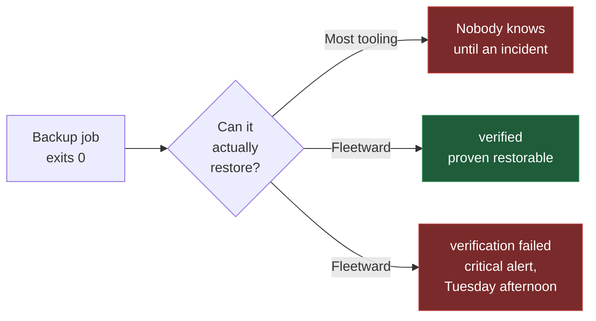

# Why Fleetward

Most backup tooling reports success when a *backup job* exits zero. That is not the same thing as
having a **restorable** backup, and the gap between those two facts is where data loss lives.

Fleetward closes it. Every backup can be automatically restored into a throwaway container of the
matching engine and version, then smoke-tested against a manifest captured at backup time. The
result is a first-class state, not a footnote.

A backup that succeeded but failed verification is surfaced as **critical** — louder than having no
backup at all, because it is more dangerous. It is the difference between knowing you are exposed
and believing you are safe.

### Built for an estate you cannot check by hand

Fleetward exists for the DBA responsible for fifty servers who cannot physically verify all of them
in a working week. Three questions, one shape — *declare what should be true, detect what actually
is, show the gap*:

| Pillar | The question it answers |
|---|---|
| **Backup compliance** | Did every server's backup run on schedule, succeed, and is it restorable? |
| **Access compliance** | Who has access, does their account expire, and who is non-compliant? |
| **Structural drift** | Did the schema change in a way nobody intended? |

Backups already taken by your existing cron and scripts are read as **observed** backups, so
Fleetward reports on your whole estate from day one without you migrating anything. Backups it takes
itself are **managed**, and only those carry a manifest that makes full verification possible —
the two are never shown as the same green checkmark
([ADR-0015](adr/0015-observed-and-managed-backups.md)).

